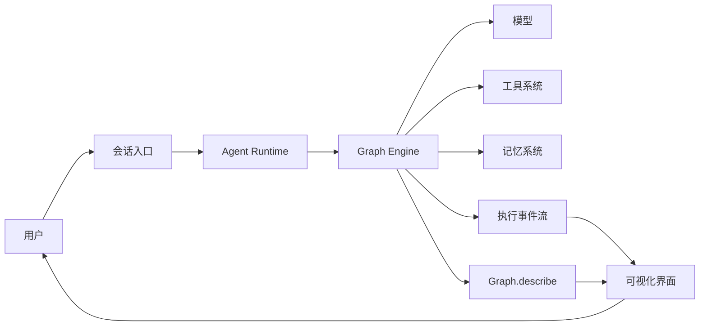

# Everything Agent

Everything Agent 的目标是构建一个真正可长期使用的个人助理 Agent：它能够理解用户意图、调用工具完成任务、保留必要的个人记忆，并以可视化方式展示每一次执行过程。

项目当前处于基础引擎阶段。已经完成可运行的 Graph Engine；模型接入、工具系统、记忆、会话运行时和可视化界面仍在后续规划中。

## 项目目标

这个项目重点解决四件事：

- **个人助理**：围绕个人任务、日程、知识和工作流提供持续协助。
- **可以行动**：通过受控工具读取信息或执行操作，而不只是生成文本。
- **过程透明**：展示节点、路由、工具调用、状态变化、耗时和错误。
- **安全可控**：限制循环次数，记录错误，对具有外部影响的操作保留确认机制。

## 当前进度

| 能力 | 状态 | 说明 |
| --- | --- | --- |
| State | 已完成 | 保存共享状态，以增量方式合并节点输出 |
| Node | 已完成 | 支持同步和异步执行函数 |
| Graph | 已完成 | 支持普通边、条件路由和并行汇合 |
| Describe | 已完成 | 从真实 Graph 生成可序列化拓扑 |
| Graph 执行器 | 已完成 | `runGraph` 支持波次并发、错误收敛和循环保护 |
| 执行事件 | 基础能力完成 | observer 可接收生命周期及节点自定义事件 |
| Agent 执行过程 | 规划中 | 模型推理、工具调用、观察结果、继续推理 |
| Tool Registry | 规划中 | 工具注册、参数校验、权限与执行结果 |
| Session / Memory | 规划中 | 会话状态、短期记忆与长期个人记忆 |
| 可视化界面 | 规划中 | 图拓扑、实时执行轨迹、状态和工具调用面板 |

## 总体架构



其中：

- `Graph.describe()` 提供静态拓扑，是可视化节点和边的唯一事实来源。
- `runGraph(..., { observer })` 提供动态事件，是节点状态、路径、耗时和错误的事实来源。
- 可视化层只消费拓扑与事件，不复制一套工作流定义，避免界面和实际执行逻辑漂移。

## 可视化执行过程

计划中的执行界面至少包含四个区域：

1. **Graph 画布**：展示节点、普通边、条件边和当前执行位置。
2. **运行时间线**：按顺序展示节点开始、结束、路由选择和错误。
3. **状态检查器**：展示每个波次合并前后的状态变化，并隐藏敏感字段。
4. **工具与模型详情**：展示工具名称、参数摘要、结果摘要、模型耗时和 token 使用量。

当前引擎已经提供以下基础事件：

| 事件 | 用途 |
| --- | --- |
| `graph_start` | 初始化一次 Graph 运行及其节点列表 |
| `node_start` | 将节点标记为运行中 |
| `node_end` | 展示耗时、写入键和异常 |
| `route` | 高亮实际选择的条件边 |
| `graph_end` | 展示最终路径、步数和首个错误 |
| 自定义事件 | 展示工具调用、模型输出进度等节点内部过程 |

后续会在不破坏现有事件的前提下，为每次运行和事件增加稳定 ID、时间戳、波次编号及脱敏后的状态增量。

## 目录结构

```text
everything-agent/
├── AGENTS.md          # 编码 Agent 的项目约束和开发规则
├── README.md          # 项目目标、架构和路线图
├── package.json       # 根目录统一管理脚本和开发依赖
├── vitest.config.js   # Engine 测试与覆盖率配置
├── engine/            # 当前已实现的 Node.js Graph Engine
│   ├── src/           # State、Node、Graph、Describe、runGraph
│   ├── test/          # Vitest 行为测试
│   └── examples/      # 最小运行示例
```

## 快速开始

环境要求：Node.js 20 或更高版本。

```bash
npm install
npm test
npm run example
```

最小工作流：

```js
import { END, START, Graph, node, runGraph } from "everything-agent";

const graph = new Graph("assistant-demo")
  .addNode(node("understand", (state) => ({
    intent: state.message.includes("天气") ? "weather" : "chat",
  })))
  .addNode(node("reply", (state) => ({
    reply: `识别到意图：${state.intent}`,
  })))
  .addEdge(START, "understand")
  .addEdge("understand", "reply")
  .addEdge("reply", END);

const events = [];
const result = await runGraph(graph, { message: "今天天气怎么样？" }, {
  observer(kind, event) {
    events.push({ kind, event });
  },
});

console.log(graph.describe());
console.log(events);
console.log(result.state.reply);
```

完整的引擎接口和执行语义请查看 [engine/README.md](./engine/README.md)。

## 设计原则

- **状态是共享黑板**：节点读取快照并返回状态增量，不直接修改引擎内部状态。
- **控制流由代码决定**：模型可以写入分类结果，路由函数负责验证并选择下一节点。
- **并发必须确定**：同一波次并行执行，但按节点声明顺序合并结果和记录路径。
- **冲突必须显式**：并行节点写入同一个状态键会失败，不允许静默覆盖。
- **错误需要可观察**：节点异常写入状态和事件；失败节点不会触发普通下游边。
- **循环必须有界**：节点通过 `maxVisits` 限制访问次数，运行通过 `maxSteps` 设置总上限。
- **可视化来自事实**：拓扑来自 `describe`，运行过程来自 observer 事件。
- **个人数据默认最小化**：日志、事件、模型上下文和长期记忆只保留完成任务所需信息。

## 路线图

### 阶段一：基础引擎（已完成）

- State、Node、Graph、Describe、runGraph
- 条件路由与并行汇合
- 错误恢复与循环保护
- Vitest 测试和覆盖率门槛

### 阶段二：Agent Runtime

- 消息与模型响应的统一数据结构
- `observe → reason → act → repeat` Agent 执行过程
- Tool Registry、工具参数校验和执行策略
- 会话级取消、超时和中断

### 阶段三：可观测性与可视化

- 稳定的 run、event、node、wave 标识
- 事件流持久化与回放
- 实时 Graph 画布和运行时间线
- 状态差异、路由原因、模型和工具详情
- 敏感字段脱敏

### 阶段四：个人助理能力

- 会话管理和短期记忆
- 可检索、可删除的长期个人记忆
- 日历、任务、笔记、文件等工具适配器
- 外部写操作确认、权限边界和审计记录

## 测试

```bash
npm test
npm run test:watch
npm run test:coverage
```

当前测试通过公开接口验证行为，不依赖私有实现。覆盖率门槛为：行、函数和语句 90%，分支 85%。

## 当前边界

- 当前仓库只有基础 Graph Engine，不包含可直接对话的完整 Agent。
- 当前 observer 是进程内回调，还不是网络事件流或持久化追踪系统。
- `State.snapshot()` 是顶层复制；节点应把收到的状态视为只读对象。
- 当前没有内置鉴权、密钥管理或个人数据加密能力。
