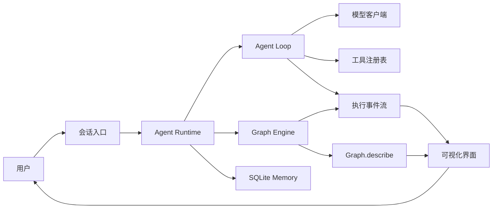

# Everything Agent

## 快速开始

环境要求：Node.js 24.12 或更高版本。后端通过 Node.js 原生 TypeScript 类型擦除直接运行 `src/`，前端仍由 Vite 处理。Memory 使用 Node.js 内置 `node:sqlite`，启动时会验证 FTS5 可用性。

```bash
npm install
npm run dev:web
```

`npm run dev:web` 是启动 Everything Agent 本地控制台、Engine 和 Agent 桥接接口的主要命令。启动后按照终端输出在浏览器中打开本地地址，并进入“配置”页面设置模型。

提交改动前可运行完整检查和示例：

```bash
npm run typecheck
npm test
npm run example
```

## 本地可视化控制台

仓库已包含一个 React + Tailwind 的本地控制台：

- **Agent**：运行真实 `runAgentLoop`，从 SQLite 恢复多轮 Session，展示 Working Memory、LLM、Tools 和 Reply。工具调用过程完整保存在本地 Chat Log，活动边和回复由真实 observer 事件驱动。
- **Workflow**：枚举 `src/workflows/` 下的 TypeScript 文件，可编辑和执行任一工作流。拓扑来自真实 `Graph.describe()`，执行由本地 Node.js 进程调用 `runGraph()`。
- **Memory**：通过 Overview、Semantic、Episodic (Session Recall)、Procedural、Chat Log 和 Consolidation 查看本地记忆与真实历史检索窗口。
- **运行记录**：只读回放 `.everything/traces/<日期>/<sessionId>.jsonl` 中的 classic loop 与 memory 执行事实，按 Session 和 Agent 回合分组展示输入、回复、模型请求/响应、工具调用、检索、耗时与错误。trace 不记录 Session 创建或选择这类 UI 活动。“配置”页面提供带二次确认的“一键清理”，可删除数据库、Session、Memory 与 trace，只保留 `.everything/EVERYTHING.md`。
- **配置**：把 Provider、主/小模型、Session Recall 预算、Context Limit、Base URL 和密钥写入根目录 `.env`，把 System Prompt 保存到 `.everything/EVERYTHING.md`。浏览器只能读取密钥是否存在及末四位。

首次运行后打开“配置”菜单，选择 Anthropic 或 OpenAI Compatible。对应环境变量为：

```dotenv
EVERYTHING_PROVIDER="anthropic"
EVERYTHING_MODEL="your-model-id"
EVERYTHING_SMALL_MODEL="your-small-model-id"
EVERYTHING_SESSION_SEARCH_WINDOW="5"
EVERYTHING_SESSION_SCROLL_STEP="10"
EVERYTHING_SESSION_RECALL_MESSAGE_LIMIT="100"
EVERYTHING_SESSION_RECALL_CHARACTER_LIMIT="50000"
EVERYTHING_CONTEXT_CHARACTER_LIMIT="200000"
EVERYTHING_BASE_URL=""
ANTHROPIC_API_KEY=""
OPENAI_API_KEY=""
```

`npm run dev:web` 同时启动页面与本地 Engine/Agent 桥接接口；浏览器不会执行工作流源码，也不会读取完整模型密钥。修改新密钥或 Base URL 时，服务端会先进行只读连接测试；失败不会覆盖旧配置，除非用户显式选择“仍然保存”。`.env` 已被 Git 忽略，不应提交。`npm run build:web` 可验证并构建浏览器静态资源到 `dist-web/`，但执行仍需要本地开发服务器。

Everything Agent 的目标是构建一个真正可长期使用的个人助理 Agent：它能够理解用户意图、调用工具完成任务、保留必要的个人记忆，并以可视化方式展示每一次执行过程。

项目当前已完成 Graph Engine、Agent Loop、两类真实模型协议适配、持久 Session、SQLite 长期 Memory、受控记忆工具、本地 Agent Harness 和 JSONL 运行记录。

## 项目目标

这个项目重点解决四件事：

- **个人助理**：围绕个人任务、日程、知识和工作流提供持续协助。
- **可以行动**：通过受控工具读取信息或执行操作，而不只是生成文本。
- **过程透明**：展示节点、路由、工具调用、状态变化、耗时和错误。
- **安全可控**：限制循环次数，记录错误，对具有外部影响的操作保留确认机制。

## 当前进度

| 能力 | 状态 | 说明 |
| --- | --- | --- |
| State | 已完成 | 保存共享状态，以增量方式合并节点输出 |
| Node | 已完成 | 支持同步和异步执行函数 |
| Graph | 已完成 | 支持普通边、条件路由和并行汇合 |
| Describe | 已完成 | 从真实 Graph 生成可序列化拓扑 |
| Graph 执行器 | 已完成 | `runGraph` 支持 wave 并发、条件汇合、停滞检测、错误收敛和循环保护 |
| 执行事件 | 基础能力完成 | observer 可接收生命周期、真实 wave 及节点自定义事件 |
| Agent Loop | 基础能力完成 | 支持模型推理、工具调用、结果观察、流式文本、迭代限制、超时和取消 |
| 模型客户端 | 基础能力完成 | 支持 Anthropic Messages 与 OpenAI Compatible，包含普通响应、SSE 流式响应和降级 |
| Tool Registry | 基础能力完成 | 注册 `get_current_time`、Semantic-only `manage_memory`、只读 `session_search` 与 `session_read` |
| Session / Memory | 基础闭环完成 | SQLite Session、结构化 Chat Log、消息级 FTS5 + BM25 Session Recall、基于 RetrievalIntent 的 gated retrieval 与 Semantic consolidation |
| Graph 前端 | 本地闭环完成 | 浏览器读写本地 TypeScript 工作流，消费真实 describe 与 observer 事件，并展示 wave、耗时和结果 |
| Agent Harness 前端 | 基础闭环完成 | 真实 Agent Loop、动态 SVG、流式 Reply、持久多轮 Session、停止与 60 秒超时 |
| 完整可视化界面 | 进行中 | 已有 Memory 管理与按 Session / 回合分组的持久 trace 时间线；状态差异和更丰富的工具仍待补充 |

## 总体架构



其中：

- `Graph.describe()` 提供静态拓扑，是可视化节点和边的唯一事实来源。
- `runGraph(..., { observer })` 提供动态事件，是节点状态、路径、耗时和错误的事实来源。
- 可视化层只消费拓扑与事件，不复制一套工作流定义，避免界面和实际执行逻辑漂移。

## 可视化执行过程

当前 Graph 前端已经实现代码编辑、Graph 画布、wave 运行卡片和最终结果。完整执行界面还将补充以下能力：

1. **Graph 画布**：展示节点、普通边、条件边和当前执行位置。
2. **运行时间线**：按顺序展示节点开始、结束、路由选择和错误。
3. **状态检查器**：展示每个 wave 合并前后的状态变化，并隐藏敏感字段。
4. **工具与模型详情**：展示工具名称、参数摘要、结果摘要、模型耗时和 token 使用量。

当前引擎已经提供以下基础事件：

| 事件 | 用途 |
| --- | --- |
| `graph_start` | 初始化一次 Graph 运行及其节点列表 |
| `wave_start` | 给出真实 wave 编号、并发节点及实际激活的入边 |
| `node_start` | 将节点标记为运行中 |
| `node_end` | 展示耗时、写入键和异常 |
| `route` | 高亮实际选择的条件边 |
| `graph_stalled` | 展示无法继续执行的节点及其未解决上游 |
| `graph_end` | 展示最终路径、步数和首个错误 |
| 自定义事件 | 展示工具调用、模型输出进度等节点内部过程 |

后续会在不破坏现有事件的前提下，为每次运行和事件增加稳定 ID、时间戳及脱敏后的状态增量。wave 编号已经由 `wave_start`、`node_start` 和 `node_end` 提供。

## 目录结构

```text
everything-agent/
├── AGENTS.md          # 编码 Agent 的项目约束和开发规则
├── README.md          # 项目目标、架构和路线图
├── package.json       # 根目录统一管理脚本和开发依赖
├── tsconfig.json      # TypeScript 严格类型检查配置
├── vitest.config.ts   # Engine 测试与覆盖率配置
├── src/
│   ├── index.ts       # 包公开入口
│   ├── engine/        # Node.js Graph Engine
│   │   ├── src/       # State、Node、Graph、Describe、runGraph
│   │   ├── test/      # Vitest 行为测试
│   │   └── examples/  # 命令行使用示例
│   ├── agent-loop/    # 模型与工具无关的 Agent 回合循环及文档
│   ├── agent-graph/    # Agent Harness 静态拓扑及文档
│   │   └── test/      # Harness 与 Runtime 集成行为测试
│   ├── memory/        # SQLite、FTS5、Session、检索和 consolidation
│   ├── tracing/       # classic loop 与 memory 的 JSONL 运行记录
│   ├── tools/         # 本地工具注册表、manage_memory 与 Session Recall
│   ├── model/         # 模型协议适配与配置接口
│   └── workflows/     # 可由本地控制台编辑、执行的真实工作流
│       └── test/      # 工作流行为测试，不参与控制台文件枚举
└── web/               # 本地 Graph 控制台及 Vite Engine 桥接接口
    └── test/          # Web 行为测试
```

## 最小工作流

```ts
import { END, START, Graph, node, runGraph } from "everything-agent";

const graph = new Graph("assistant-demo")
  .addNode(node("understand", (state) => ({
    intent: state.message.includes("天气") ? "weather" : "chat",
  })))
  .addNode(node("reply", (state) => ({
    reply: `识别到意图：${state.intent}`,
  })))
  .addEdge(START, "understand")
  .addEdge("understand", "reply")
  .addEdge("reply", END);

const events = [];
const result = await runGraph(graph, { message: "今天天气怎么样？" }, {
  observer(kind, event) {
    events.push({ kind, event });
  },
});

console.log(graph.describe());
console.log(events);
console.log(result.state.reply);
```

完整的引擎接口和执行语义请查看 [Engine 文档](./src/engine/README.md)，Agent 回合接口请查看 [Agent Loop 文档](./src/agent-loop/README.md)，静态 Harness 拓扑请查看 [Agent Graph 文档](./src/agent-graph/README.md)，持久记忆语义请查看 [Memory 文档](./src/memory/README.md)。

## 设计原则

- **状态是共享黑板**：节点读取快照并返回状态增量，不直接修改引擎内部状态。
- **控制流由代码决定**：模型可以写入分类结果，路由函数负责验证并选择下一节点。
- **并发必须确定**：同一 wave 并行执行，但按节点声明顺序合并结果和记录路径。
- **激活决定汇合**：条件分支未命中的路径会显式跳过，汇合只等待本次运行需要解决的上游。
- **冲突必须显式**：并行节点写入同一个状态键会失败，不允许静默覆盖。
- **错误需要可观察**：节点异常写入状态和事件；失败节点不会触发普通下游边。
- **停滞不是完成**：没有可运行节点但仍有部分依赖未解决时，运行返回 `stalled` 和阻塞节点。
- **循环必须有界**：节点通过 `maxVisits` 限制访问次数，运行通过 `maxSteps` 设置总上限。
- **可视化来自事实**：拓扑来自 `describe`，运行过程来自 observer 事件。
- **个人数据默认最小化**：日志、事件、模型上下文和长期记忆只保留完成任务所需信息。

## 路线图

### 阶段一：基础引擎（已完成）

- State、Node、Graph、Describe、runGraph
- 条件路由与并行汇合
- 错误恢复与循环保护
- Vitest 测试和覆盖率门槛

### 阶段二：Agent Runtime

- `observe → reason → act → repeat` Agent 执行过程（基础能力已完成）
- 迭代限制、超时、取消和运行事件（基础能力已完成）
- 消息与模型响应的统一数据结构（当前暂用 Anthropic Messages 形状）
- Tool Registry、工具参数校验和执行策略
- 会话管理及跨回合中断

### 阶段三：可观测性与可视化

- 稳定的 run、event、node、wave 标识
- 事件流持久化与回放
- 实时 Graph 画布和运行时间线
- 状态差异、路由原因、模型和工具详情
- 敏感字段脱敏

### 阶段四：个人助理能力

- 会话管理和短期记忆（基础闭环已完成）
- 可检索、可删除的长期个人记忆（基础闭环已完成）
- 日历、任务、笔记、文件等工具适配器
- 外部写操作确认、权限边界和审计记录

## 测试

```bash
npm test
npm run test:watch
npm run test:coverage
npm run typecheck
npm run build
```

当前测试通过公开接口验证行为，不依赖私有实现。覆盖率门槛为：行、函数和语句 90%，分支 85%。
`npm run build` 会先严格检查后端 TypeScript，再由 Vite 检查并构建前端到 `dist-web/`。后端不生成 `dist/`；Node.js 直接加载 `.ts` 源码。`tsconfig.json` 只服务于静态类型检查，Node.js 运行时不会读取它。

## 当前边界

- 当前 Session 和 Memory 是单用户、本地实现，不包含多租户或云同步。
- 当前 Session 的全部完整回合进入 Working Memory，并完全排除在 Session Recall 之外。完整模型输入使用可配置字符上限；零运行时依赖和多模型支持使项目无法可靠使用单一 tokenizer，因此 Context Limit 不以 token 为单位。
- Session Recall 当前只有 FTS5 + BM25 词法召回；Embedding 和多路融合尚未实现。工具结果不参与索引，但恢复命中窗口时会随完整 run 返回。
- JSONL trace 只覆盖 classic loop 与 memory；Workflow 继续使用实时 observer，不写入该目录。记录按 `.everything/traces/YYYY-MM-DD/<sessionId>.jsonl` 存放，无 Session 的事件写入同日期的 `system.jsonl`，不读取旧版根目录 JSONL。V2 记录为每个事件生成 `eventId` 和 run 内递增的 `sequence`；`model_request` 保存每次调用实际使用的 System Prompt、messages、工具 schema 和生成参数，`model_response` 保存完整标准化响应，工具事件保存结构化参数与结果，内容不做长度截断。常见凭证字段与 Bearer token 仍会在写入前移除。`context_assembled` 只记录上下文的组装数量与记忆来源，模型请求才是 eval 的权威输入快照。
- `State.snapshot()` 是顶层复制；节点应把收到的状态视为只读对象。
- 当前没有内置鉴权、密钥管理或个人数据加密能力。
