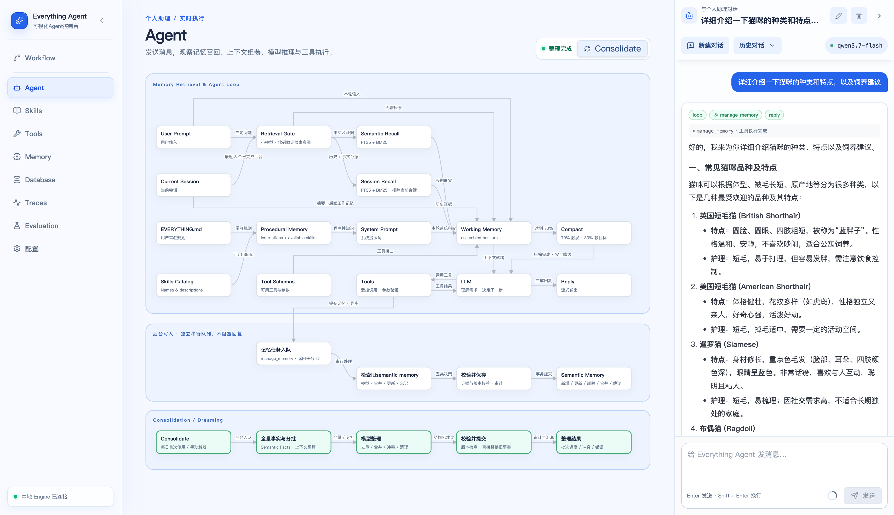
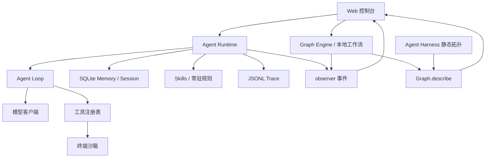

# Everything Agent

一个运行在本地的个人助理 Agent：通过模型和受控工具完成任务，保留可检索的个人记忆，并在可视化控制台中展示记忆召回、上下文组装、模型推理和工具执行过程。

**API Key 仅在本地持久化。** 会话、记忆和运行记录默认保存在本地；你自行选择模型服务并配置连接。



## 快速开始

### 1. 准备环境并启动

需要 **Node.js 24.12 或更高版本**，以及支持 OpenAI Compatible、Anthropic Messages 或 Google Gemini 原生协议的模型服务。

首次使用推荐选择与电脑操作系统和 CPU 架构匹配的发布包，进入对应的 release 目录执行 `npm start`。发布包已包含生产依赖，无需安装依赖或重新构建。例如 Apple Silicon Mac：

```bash
cd release/everything-agent-darwin-arm64
npm start
```

如果收到的是压缩包，先解压，再进入其中包含 `package.json` 的目录执行 `npm start`。其他平台请使用对应的发布目录；Node.js 需要自行安装。

如果发布包 `npm start` 无法启动（例如平台不匹配、缺少对应平台的预编译原生模块），可以改用开发模式：回到**仓库根目录**执行 `pnpm install` 安装依赖，再执行 `pnpm run dev` 启动。开发模式直接运行源码，同样提供 Web 控制台与本地后端，并支持在 Workflow 页面编辑工作流；相关命令见下方“开发与检查”。

生产环境的 Workflow 页面支持查看、选择和执行工作流，不支持编辑。个人数据默认保存在启动目录下的 `.everything/`，也可通过 `EVERYTHING_HOME` 指定数据根目录。平台限制、数据位置及故障排查见 [生产构建、打包与交付](docs/production.md)。开发启动和打包命令见下方“开发与检查”。

按终端输出打开本地地址。此命令同时启动 Web 控制台与本地后端，使用期间保持终端运行；按 `Ctrl+C` 停止。

首次启动会自动创建 `.everything/` 下的配置、数据库、规则文件和 Skills 目录，无需手动创建 `.env`，也不需要先部署 Docker 或 Langfuse。未配置模型时也能打开控制台。

### 2. 配置两个模型连接

进入左侧 **配置** 页面，分别填写并保存 **Agent Model** 和 **Small Model**：

| 连接 | 用途 | 首次使用要求 |
| --- | --- | --- |
| Agent Model | 主推理、工具调用、记忆写入与整理 | 配置支持工具调用的模型 |
| Small Model | 判断本轮是否需要检索记忆，以及检索什么 | 同样需要完整配置 |

两者的连接配置相互独立，不会自动共用或回退。可以在两处填写同一组服务地址、模型和密钥，先完成首次运行，再按需要分别调整。

每个连接包含以下字段：

| 字段 | 如何填写 |
| --- | --- |
| Provider | 按服务使用的协议选择 `OpenAI Compatible`、`Anthropic` 或 `Google Gemini` |
| Model | 服务提供的准确模型 ID，不是自行起的名称 |
| Base URL | 服务的 API 基础地址；OpenAI Compatible 通常包含 `/v1`，Anthropic 使用服务根地址，Gemini 默认使用 `https://generativelanguage.googleapis.com/v1beta`；不要追加生成接口的方法或路径 |
| API Key | 对应服务的密钥，保存后只显示已配置状态和末四位 |

使用代理或自建服务时，填写其实际 API 基础地址。保存新的密钥、Provider 或 Base URL 时，后端会尝试读取模型列表来测试连接；失败默认不会覆盖已有配置。部分兼容服务不提供模型列表接口，可核实配置后选择“仍然保存”，再通过实际对话验证。

使用 **Google Gemini** 时，选择该 Provider，填写 Gemini 模型 ID 与 API Key，Base URL 留空即使用 Google 官方地址，也支持包含 API 版本的原生协议代理地址。当前接入 API Key 认证的 Gemini Developer API，支持文本、流式回复和工具调用；不包含 Vertex AI 身份认证、图片或音视频能力，Embedding 独立支持 OpenAI Compatible 与 Google Gemini。详见 [模型适配文档](src/model/README.md)。

同时检查运行参数中的 **Context Window** 和 **单次模型输出**，使它们符合所选模型的限制。当前默认值分别为 262,144 和 32,768 tokens，并非所有模型都支持；输入、输出预留和安全余量需要共同满足上下文限制。

### 3. 发送第一条消息

返回 **Agent**，发送“你好，请介绍一下你能做什么”。看到右侧逐步生成回复、中间画布展示执行活动，即可确认基本对话已跑通。

之后可以尝试“请记住，我喜欢简洁的中文回答”，再到 **Memory** 查看后台写入结果。记忆写入是异步任务，回复结束时可能还未完成；可通过 **Traces** 查看运行过程。

首次使用保持默认关键词检索即可，**无需配置 Embedding、联网搜索或终端工具**。

## API Key 与本地数据

**通过配置页面保存的模型、Embedding 和 Tavily API Key，只持久化到本机的 `.everything/.env`。** 普通设置与密钥分开保存，配置读取接口不会返回完整密钥，只返回是否已配置及末四位。整个 `.everything/` 已被 Git 忽略。

“本地保存”指存储位置：本地后端仍会使用密钥向你配置的服务地址发起认证请求，因此请确认 Base URL 属于你信任的服务。密钥文件没有加密，具有本机文件读取权限的程序仍可能访问它。

| 默认路径 | 内容 |
| --- | --- |
| `.everything/.env` | 模型、Embedding 与 Tavily 密钥 |
| `.everything/config.json` | 模型连接参数、检索设置、运行预算和工具开关 |
| `.everything/database/state.db` | 会话、聊天记录、长期记忆与后台任务 |
| `.everything/EVERYTHING.md` | 可编辑的助理常驻规则 |
| `.everything/skills/` | 本地 Skill 文件 |
| `.everything/traces/` | JSONL 执行记录 |
| `.everything/sandbox/` | 默认终端工具工作区 |

还需要了解以下数据边界：

- **模型调用会发送必要上下文**：包括当前对话、召回的记忆、规则，以及所需工具信息；启用向量检索或联网搜索后，相关内容也会发送到对应服务。
- **本地 Trace 可能包含私人内容**：记录会对常见凭证进行脱敏，但可能保留模型输入、回复和工具结果。分享日志前请检查内容。
- **日常远程 Trace 导出默认关闭**：手动启用 Langfuse 后，默认仅导出元数据；内容采集和评估回传有各自的数据边界，见 [Tracing 文档](src/tracing/README.md) 与 [Evaluation 文档](src/evaluation/README.md)。
- **清除数据不等于清除密钥**：配置页的“清除全部数据”保留模型配置、密钥、常驻规则、Skills 和 Langfuse 连接配置，也不会删除已经上传的远端记录。

备份时建议停止服务后复制 `.everything/`，并将备份视为包含凭证与个人信息的私人文件保存。

## 可选配置

| 需求 | 配置入口与说明 |
| --- | --- |
| 调整助理常驻规则 | 在配置页编辑 Procedural Memory，保存到 `.everything/EVERYTHING.md` |
| 使用 Skills | 在 **Skills** 页面创建或编辑技能；每轮仅注入名称与描述，使用时再加载正文，见 [Skills 文档](src/skills/README.md) |
| 启用语义向量检索 | 在配置页的 Memory Retrieval 中选择 Dense 或 Hybrid，并选择独立的 Embedding Provider（OpenAI Compatible / Google Gemini），填写连接参数并重建索引；固定请求 1024 维向量。历史会话检索始终使用 FTS5，见 [Memory 文档](src/memory/README.md) |
| 联网搜索 | 在 **Tools** 中配置 Tavily API Key 并启用 `search_web` |
| 执行终端命令 | 在配置页 **Sandbox** 确认工作区，再在 **Tools** 启用 `run_terminal`；默认关闭，见 [Sandbox 文档](src/sandbox/README.md) |
| 体验已有数据 | 执行 `pnpm run mock-data`，使用本地模拟模型生成并合并数据，不联网、不消耗模型额度，见 [模拟数据说明](mock-data/README.md) |
| 接入追踪与评估 | 按 [Langfuse 部署说明](deploy/langfuse/README.md) 和 [Evaluation 使用说明](src/evaluation/README.md) 操作；日常对话无需部署这些服务 |

终端工具在 macOS 使用 Seatbelt，在 Linux / WSL2 使用 bubblewrap；平台无法建立沙箱时不会退化为无保护执行，原生 Windows 不提供此能力。默认禁止出站网络，命令只能写入指定工作区和会话临时目录；工作区内的文件仍可能被命令修改或删除，需要谨慎处理审批请求。

## 功能概览

| 页面 | 当前已实现的能力 |
| --- | --- |
| Agent | 多轮会话、流式回复、停止生成，以及记忆召回、模型推理、工具执行的实时展示 |
| Memory | 查看与管理长期记忆、检索历史会话、查看 Chat Log 和记忆整理结果 |
| Skills | 创建、编辑、重命名和删除本地技能，供 Agent 按需读取 |
| Tools | 查看真实工具目录，配置可选工具与启用状态 |
| Traces | 查看本地持久化运行记录，排查模型、工具与记忆任务的耗时和错误 |
| Workflow | 编辑并执行本地 TypeScript Graph 工作流，展示真实拓扑和执行事件 |
| Database | 查看 SQLite 表与数据，执行受限 SQL；写入操作需要页面确认 |
| Evaluation | 使用真实模型和工具运行数据集评估，查看执行、同步与评分状态 |
| 配置 | 管理模型连接、运行预算、检索、常驻规则、沙箱与本地数据 |

长期记忆写入在后台串行处理，支持新增、更新、删除和合并；另有每日与手动触发的 Consolidation，用于整理已有事实。完整机制见 [Memory](src/memory/README.md) 和 [Consolidation](src/memory/CONSOLIDATION.md)。

## 项目架构

Agent 聊天区仅对运行中的回复实时计时；完成后使用运行耗时，停止或失败时冻结耗时。重新加载历史记录时，耗时取用户消息与最终回复的记录时间差；未完成或时间无效的历史回合显示“耗时未知”。

Web 控制台连接本地 Node.js 后端。个人助理由 Agent Runtime 组合模型、工具和记忆；Graph 工作流通过独立入口运行。下图展示当前已实现的模块关系：



- **Engine**：零运行时依赖，负责 State、Node、Graph、路由、并发、错误与循环保护，不直接初始化模型、数据库或 UI。
- **Agent Loop**：执行 `observe → reason → act → repeat`，提供迭代上限、超时、取消与工具调用事件。
- **Agent Runtime**：负责本地配置、会话上下文、记忆检索、后台任务以及模型和工具的集成。
- **可视化**：静态拓扑来自 `Graph.describe()`，执行活动来自 observer 事件；页面不根据最终结果猜测执行路径。

主要目录与详细文档：

| 目录 | 职责 / 文档 |
| --- | --- |
| `web/` | React 控制台与 Vite 本地后端桥接 |
| `src/engine/` | [Graph 公开接口、执行语义与示例](src/engine/README.md) |
| `src/agent-loop/` | [Agent 回合接口与事件](src/agent-loop/README.md) |
| `src/agent-runtime/` | [集成接口、配置与资源生命周期](src/agent-runtime/README.md) |
| `src/agent-graph/` | [Agent Harness 拓扑与可视化边界](src/agent-graph/README.md) |
| `src/model/`、`src/tools/` | [模型协议适配](src/model/README.md)与工具注册、校验、执行 |
| `src/memory/` | [Session、SQLite、检索与长期记忆](src/memory/README.md) |
| `src/skills/`、`src/sandbox/` | [按需技能](src/skills/README.md)与[终端执行边界](src/sandbox/README.md) |
| `src/tracing/`、`src/evaluation/` | [运行记录](src/tracing/README.md)与[真实环境评估](src/evaluation/README.md) |
| `src/workflows/` | 可编辑、执行的本地工作流 |
| `deploy/langfuse/`、`mock-data/` | 可选服务部署与模拟数据工具 |

## 常见问题

**启动时提示 Node.js、SQLite 或原生模块错误？**

先用 `node --version` 确认运行版本不低于 24.12，再执行 `pnpm install`。项目使用 Node.js 内置 SQLite 和 @node-rs/jieba 原生分词模块（平台预编译二进制，无需本地编译）；如果 @node-rs/jieba 安装失败，请根据安装日志检查当前平台是否有对应的预编译包。

**能打开页面，但无法发送消息？**

检查 Agent Model 和 Small Model 是否都已填写 Model、API Key 和正确的 Provider / Base URL。仅配置主模型不足以运行完整回合。401 / 403 通常与密钥或权限有关，404 则需要检查基础地址、协议和模型 ID。

**连接测试失败，但服务地址看起来正确？**

保存时的连接测试读取模型列表，不能保证服务支持实际推理或工具调用；反过来，某些兼容服务也可能支持推理但不支持模型列表。核实服务能力后再决定是否“仍然保存”，最终通过一次实际对话确认。

**模型报输出额度或上下文超限？**

按服务的实际限制调整 Context Window 和单次模型输出。长对话达到可用输入额度的 70% 时自动 compact，使用主模型将旧历史汇总为摘要，以压缩后总输入约 30% 为软目标；当前请求与最近完整交互优先保留，原始记录可回查，检查点在 Session 中持久化。固定输入本身过大时仍会明确报错；提高 Agent 最大迭代数不会扩大模型上下文。当前默认最多 100 轮迭代，单次 Agent 回合超时为 300 秒，也可以在界面主动停止。

**构建后可以只部署静态文件吗？**

不能。`npm run build:web` 只生成浏览器资源；Engine / Agent 接口仍需要后端。执行 `npm run build` 后通过 `npm start` 启动生产服务，它同时提供静态页面和后端接口。

## 开发与检查

前端已接入 Tailwind v4，基础 UI、PageHeading 和 Tools 页面主体使用工具类；其余页面按模块增量迁移。设计尺度与语义颜色统一定义在 `web/src/index.css`，新旧样式共用变量。SVG、滚动条、details/summary、动画、Markdown 排版与动态几何保留手写样式，Tools 仍复用共享页面容器、表单和提示动画。迁移规范见 [AGENTS.md](AGENTS.md#前端样式规范)。

项目开发使用 pnpm，仓库只维护 `pnpm-lock.yaml`，变更依赖时应同步更新该锁文件。发布包通过 Node.js 自带的 npm 启动，无需安装 pnpm。项目使用 ESM 和严格模式 TypeScript。开发时后端使用 TypeScript 源码；生产构建将后端和工作流编译到 `dist-server/`，由 Node.js 运行，前端由 Vite 构建到 `dist-web/`。

克隆仓库后，在项目根目录安装依赖并启动开发服务：

```bash
pnpm install
pnpm run dev
```

开发环境可以在 Workflow 页面直接编辑 `src/workflows/*.ts`。“重新读取”按钮使用与“刷新数据”一致的加载动效，读取完成后显示成功或失败消息。生产运行对应的构建产物，修改源码后需重新构建、打包并重启。

检查与打包命令：

```bash
pnpm run typecheck      # 后端类型检查
pnpm test              # Vitest 行为测试
pnpm run test:coverage # 覆盖率检查
pnpm run build         # 后端与工作流编译 + 前端类型检查与构建
pnpm run example       # 最小 Graph 示例，无需模型密钥
pnpm run package       # 将已有构建产物打包到 release/
pnpm run verify:package # 验证发布包可独立启动
```

测试通过公开接口验证行为，放在对应模块的 `test/` 目录中。覆盖率门槛为语句、函数和行 85%，分支 80%。开发约束见 [AGENTS.md](AGENTS.md)。

## 当前边界与路线图

当前已经跑通本地个人助理的基础闭环：模型与工具调用、多轮会话、长期记忆、Skills、执行可视化、Trace 和可选真实评估。项目仍处于需求开发阶段，接口和数据结构可能直接调整，不提供旧版本兼容保证。

当前边界：

- 面向单用户、本地使用，没有内置鉴权、多租户、云同步或本地数据加密，不应直接将控制台暴露到公网。
- 控制台内切换页面可继续运行，但浏览器刷新或关闭后不支持恢复正在进行的前台运行。
- Agent 与 Memory 有持久 JSONL 记录；Workflow 当前使用实时 observer，不写入同一套 Trace。
- 沙箱约束执行范围，人工审批处理部分外部影响与破坏性操作；命令文本匹配不构成完整的安全保证。

后续计划：

- 完善状态差异展示和执行过程检查体验。
- 增加日历、任务、笔记等个人助理工具适配器。
- 随工具扩展完善权限、外部写入确认和审计能力。

这些方向尚未全部实现，具体可用能力以当前代码与模块文档为准。

### 会话与执行标识

`sessionId` 标识会话，`turnId` 标识一次用户提交到回复、失败或取消的完整回合。回合内使用 `iteration` 区分推理迭代，后台任务使用 `taskId`，并通过 `sourceTurnId` 关联来源回合。Trace 使用 `traceId` 统一归组，聊天生命周期事件为 `turn_started`、`turn_completed`、`turn_failed`。Engine 的 `runGraph()` 与评估实验的 Run 保留各自执行语义。完整术语见 [领域术语](./CONTEXT.md)，事件协议见 [Tracing](./src/tracing/README.md)。
