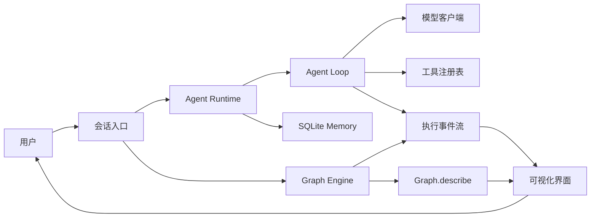

# Everything Agent

## 快速开始

环境要求：Node.js 24.12 或更高版本。后端通过 Node.js 原生 TypeScript 类型擦除直接运行 `src/`，前端仍由 Vite 处理。Memory 使用 Node.js 内置 `node:sqlite`，启动时会验证 FTS5 可用性；Session 与 Semantic FTS 共用 nodejieba 中文搜索分词、identifier 整体与组成词索引。

```bash
pnpm install
pnpm run dev:web
```

`pnpm run dev:web` 是启动 Everything Agent 本地控制台、Engine 和 Agent 桥接接口的主要命令。启动后按照终端输出在浏览器中打开本地地址，并进入“配置”页面设置模型。

提交改动前可运行完整检查和示例：

```bash
pnpm run typecheck
pnpm test
pnpm run example
```

需要一批本地测试数据时，可用模拟模型驱动真实 Runtime 生成并合并进现有数据目录，不消耗模型额度也不联网：

```bash
pnpm run mock-data
```

数据默认合并进 `.everything/`，写过的数据集不会重复写入，模型配置与向量索引不受影响；详见 [`mock-data/README.md`](mock-data/README.md)。

## 本地可视化控制台

仓库已包含一个 React + Tailwind CSS v4 + shadcn/ui 的本地控制台。页面共用本地设计令牌和可复用基础组件，Graph 与 Agent Harness 画布仍以真实拓扑和 observer 事件为唯一事实来源：

- **Agent**：运行真实 `runAgentLoop`，从 SQLite 恢复多轮 Session，展示输入、记忆需求判断、事实与历史召回、上下文组装、推理、工具和回复；独立后台区域展示记忆写入与跨会话整理关系。工具调用过程完整保存在本地 Chat Log，活动边和回复由真实 observer 事件驱动。输入框发送按钮左侧的圆环显示当前 Session 的上下文水位，分子分母与 Agent Loop 的 Context Window 硬限制同口径（已用估算 ÷ 扣除输出预留与安全余量后的可用额度），因此不会出现「圆环未满却报超限」；该估算不含本轮检索注入的记忆，是下限。
- **Workflow**：枚举 `src/workflows/` 下的 TypeScript 文件，可编辑和执行任一工作流。拓扑来自真实 `Graph.describe()`，执行由本地 Node.js 进程调用 `runGraph()`。
- **Memory**：通过 Overview、Semantic、Session Recall、Procedural、Chat Log 和 Consolidation 查看本地记忆与真实历史检索窗口。Session Recall 结果按消息分段展示，结构化内容保留缩进、正文换行；查询留空可查看最近活跃会话。
- **Skills**：新建、编辑、重命名和删除 `.everything/skills/<skill-name>/SKILL.md`。每轮 Agent 只注入 Skill 名称与描述，需要使用时通过受控 `read_skill` 工具加载正文；目录发现、加载和工具调用均进入 observer 与 JSONL trace。
- **Tools**：按来源展示 Agent 的真实工具目录。`manage_memory`、`session_search`、`session_read` 与 `read_skill` 固定启用；`get_current_time` 和 Tavily `search_web` 可独立启停，点击开关后立即保存；保存期间仅当前开关暂时禁用，其他开关可独立操作。工具开关写入 `.everything/config.json`，Tavily 密钥写入 `.everything/.env`；浏览器只读取密钥状态和末四位。
- **Database**：列出 `.everything/database/state.db` 的全部普通表、字段类型、行数和最多 200 条最新数据，不展示 SQLite 内部表、FTS5 虚拟表及其索引中间表。SQL Console 支持单条 `SELECT`、只读 `WITH`、`INSERT`、`UPDATE` 和 `DELETE`；数据写操作执行前必须在页面二次确认，DDL 始终禁止。
- **运行记录**：只读列出 `.everything/traces/<日期>/<序号>-session-<sessionId>.jsonl` 中的 classic loop 与 memory 执行事实，页面按 JSONL 文件直接展示已脱敏事件，不额外推导 Session 或 Agent 回合结构。trace 不记录 Session 创建、选择，以及 Memory 页面手动搜索记忆或历史会话这类 UI 活动；Agent 内部检索仍记录执行事件。“配置”页面提供带二次确认的“清除全部数据”，可删除数据库、Session、Memory 与 trace，保留 `.everything/EVERYTHING.md`、`.everything/skills`、`.everything/config.json` 和 `.everything/.env` 密钥。
- **配置**：Agent Model 与 Small Model 各自拥有独立的 Provider、Model、Base URL 和 API Key；非敏感连接参数、Session Recall 预算和 Context Limit 等运行参数写入 `.everything/config.json`，四类 API Key 单独保存在 `.everything/.env`，用户可编辑的 Procedural Memory 保存到 `.everything/EVERYTHING.md`，与运行时内置的基础角色、Semantic Memory 策略和 Skills Catalog 一起组装 System Prompt。浏览器只能读取各密钥是否存在及末四位。

运行 `pnpm run dev:web` 时，在接受页面请求前自动创建缺失的 `.everything/`、`config.json`、`EVERYTHING.md`、`skills/`、数据库和 `.everything/.env`，已有文件保留不变。根目录没有 `EVERYTHING.md` 模板时使用内置中文提示词。未配置模型密钥也能打开控制台、查看空数据并编辑配置；调用模型前需要在“配置”页面填写连接信息。打开“配置”菜单即可维护 JSON 中的普通设置；`.everything/.env` 只保存以下密钥：

```dotenv
EVERYTHING_AGENT_API_KEY=""
EVERYTHING_SMALL_API_KEY=""
EVERYTHING_EMBEDDING_API_KEY=""
TAVILY_API_KEY=""
```

Agent Model 用于主 Agent 推理、工具调用、记忆写入和 consolidation；Small Model 仅用于 retrieval gate，两者不会互相回退或复用连接。`pnpm run dev:web` 同时启动页面与本地 Engine/Agent 桥接接口；浏览器不会执行工作流源码，也不会读取完整模型密钥。修改任一连接的新密钥、Provider 或 Base URL 时，服务端会先对该连接进行只读测试；失败不会覆盖旧配置，除非用户显式选择“仍然保存”。整个 `.everything/`（含其中的 `.env`）都已被 Git 忽略，不应提交。`pnpm run build:web` 可验证并构建浏览器静态资源到 `dist-web/`，但执行仍需要本地开发服务器。

Everything Agent 的目标是构建一个真正可长期使用的个人助理 Agent：它能够理解用户意图、调用工具完成任务、保留必要的个人记忆，并以可视化方式展示每一次执行过程。

项目当前已完成 Graph Engine、Agent Loop、两类真实模型协议适配、持久 Session、SQLite 长期 Memory、本地 Skills、受控工具、本地 Agent Harness 和 JSONL 运行记录。

## 项目目标

这个项目重点解决四件事：

- **个人助理**：围绕个人任务、日程、知识和工作流提供持续协助。
- **可以行动**：通过受控工具读取信息或执行操作，而不只是生成文本。
- **过程透明**：展示节点、路由、工具调用、状态变化、耗时和错误。
- **安全可控**：限制循环次数，记录错误，对具有外部影响的操作保留确认机制。

## 当前进度

| 能力 | 状态 | 说明 |
| --- | --- | --- |
| State | 已完成 | 保存共享状态，以增量方式合并节点输出 |
| Node | 已完成 | 支持同步和异步执行函数 |
| Graph | 已完成 | 支持普通边、条件路由和并行汇合 |
| Describe | 已完成 | 从真实 Graph 生成可序列化拓扑 |
| Graph 执行器 | 已完成 | `runGraph` 支持 wave 并发、条件汇合、停滞检测、错误收敛和循环保护 |
| 执行事件 | 基础能力完成 | observer 可接收生命周期、真实 wave 及节点自定义事件 |
| Agent Loop | 基础能力完成 | 支持模型推理、工具调用、结果观察、流式文本、迭代限制、超时和取消 |
| 模型客户端 | 基础能力完成 | 支持 Anthropic Messages 与 OpenAI Compatible，包含普通响应、SSE 流式响应和降级 |
| Tool Registry | 基础能力完成 | 固定注册记忆、会话召回与 Skill 工具；支持可配置的 `get_current_time` 和 Tavily `search_web`，Tools 页面开关下一回合生效 |
| Session / Memory | 基础闭环完成 | SQLite Session、结构化 Chat Log、消息级 FTS5 + BM25 Session Recall、基于 RetrievalIntent 的 gated retrieval；聊天异步记忆写入；每日与手动全量 semantic facts 整理 |
| Graph 前端 | 本地闭环完成 | 浏览器读写本地 TypeScript 工作流，消费真实 describe 与 observer 事件，并展示 wave、耗时和结果 |
| Agent Harness 前端 | 基础闭环完成 | 真实 Agent Loop、动态 SVG、流式 Reply、持久多轮 Session、停止与 60 秒超时 |
| 完整可视化界面 | 进行中 | 已有 Memory 管理与按 JSONL 文件列出的持久 trace 查看页；状态差异和更丰富的工具仍待补充 |

## 总体架构



当前 `src/agent-runtime/` 已承担个人助理回合编排、配置持久化和本地资源生命周期；Web 层负责请求校验与页面数据组装。Agent Runtime 调用 Agent Loop，Graph 工作流仍由独立入口运行。

其中：

- `Graph.describe()` 提供静态拓扑，是可视化节点和边的唯一事实来源。
- `runGraph(..., { observer })` 提供动态事件，是节点状态、路径、耗时和错误的事实来源。
- 可视化层只消费拓扑与事件，不复制一套工作流定义，避免界面和实际执行逻辑漂移。

## 可视化执行过程

Agent 业务画布直接置于页面的可滚动内容区，不额外包裹边框卡片；内部流程分区仍保留边界。

当前 Graph 前端已经实现代码编辑、Graph 画布、wave 运行卡片和最终结果。完整执行界面还将补充以下能力：

1. **Graph 画布**：展示节点、普通边、条件边和当前执行位置。
2. **运行时间线**：按顺序展示节点开始、结束、路由选择和错误。
3. **状态检查器**：展示每个 wave 合并前后的状态变化，并隐藏敏感字段。
4. **工具与模型详情**：展示工具名称、参数摘要、结果摘要、模型耗时和 token 使用量。

当前引擎已经提供以下基础事件：

| 事件 | 用途 |
| --- | --- |
| `graph_start` | 初始化一次 Graph 运行及其节点列表 |
| `wave_start` | 给出真实 wave 编号、并发节点及实际激活的入边 |
| `node_start` | 将节点标记为运行中 |
| `node_end` | 展示耗时、写入键和异常 |
| `route` | 高亮实际选择的条件边 |
| `graph_stalled` | 展示无法继续执行的节点及其未解决上游 |
| `graph_end` | 展示最终路径、步数和首个错误 |
| 自定义事件 | 展示工具调用、模型输出进度等节点内部过程 |

后续会在不破坏现有事件的前提下，为每次运行和事件增加稳定 ID、时间戳及脱敏后的状态增量。wave 编号已经由 `wave_start`、`node_start` 和 `node_end` 提供。

## 目录结构

```text
everything-agent/
├── AGENTS.md          # 编码 Agent 的项目约束和开发规则
├── README.md          # 项目目标、架构和路线图
├── package.json       # 根目录统一管理脚本和开发依赖
├── tsconfig.json      # TypeScript 严格类型检查配置
├── vitest.config.ts   # Engine 测试与覆盖率配置
├── src/
│   ├── index.ts       # 包公开入口
│   ├── engine/        # Node.js Graph Engine
│   │   ├── src/       # State、Node、Graph、Describe、runGraph
│   │   ├── test/      # Vitest 行为测试
│   │   └── examples/  # 命令行使用示例
│   ├── agent-runtime/ # 个人助理集成、配置、资源生命周期及测试
│   ├── agent-loop/    # 模型与工具无关的 Agent 回合循环及文档
│   ├── agent-graph/    # Agent Harness 静态拓扑及文档
│   │   └── test/      # Harness 与 Runtime 集成行为测试
│   ├── memory/        # SQLite、FTS5、Session、检索和 consolidation
│   ├── sandbox/       # 由内核强制的命令执行边界（Seatbelt / bubblewrap）
│   ├── skills/        # Skill 文件存储、目录发现和按需读取工具
│   ├── tracing/       # classic loop 与 memory 的 JSONL 运行记录
│   ├── tools/         # 本地工具注册表、manage_memory、Session Recall 与 run_terminal
│   ├── model/         # 模型协议适配与配置接口
│   └── workflows/     # 可由本地控制台编辑、执行的真实工作流
│       └── test/      # 工作流行为测试，不参与控制台文件枚举
└── web/               # 本地 Graph 控制台及 Vite Engine 桥接接口
    ├── src/
    │   ├── pages/     # 一级页面及其页面专属组件
    │   └── components/# 跨页面复用组件与基础 UI
    └── test/          # Web 行为测试
```

## 最小工作流

```ts
import { END, START, Graph, node, runGraph } from "everything-agent";

const graph = new Graph("assistant-demo")
  .addNode(node("understand", (state) => ({
    intent: state.message.includes("天气") ? "weather" : "chat",
  })))
  .addNode(node("reply", (state) => ({
    reply: `识别到意图：${state.intent}`,
  })))
  .addEdge(START, "understand")
  .addEdge("understand", "reply")
  .addEdge("reply", END);

const events = [];
const result = await runGraph(graph, { message: "今天天气怎么样？" }, {
  observer(kind, event) {
    events.push({ kind, event });
  },
});

console.log(graph.describe());
console.log(events);
console.log(result.state.reply);
```

完整的引擎接口和执行语义请查看 [Engine 文档](./src/engine/README.md)，本地集成接口请查看 [Agent Runtime 文档](./src/agent-runtime/README.md)，Agent 回合接口请查看 [Agent Loop 文档](./src/agent-loop/README.md)，静态 Harness 拓扑请查看 [Agent Graph 文档](./src/agent-graph/README.md)，持久记忆语义请查看 [Memory 文档](./src/memory/README.md)。

## 设计原则

- **状态是共享黑板**：节点读取快照并返回状态增量，不直接修改引擎内部状态。
- **控制流由代码决定**：模型可以写入分类结果，路由函数负责验证并选择下一节点。
- **并发必须确定**：同一 wave 并行执行，但按节点声明顺序合并结果和记录路径。
- **激活决定汇合**：条件分支未命中的路径会显式跳过，汇合只等待本次运行需要解决的上游。
- **冲突必须显式**：并行节点写入同一个状态键会失败，不允许静默覆盖。
- **错误需要可观察**：节点异常写入状态和事件；失败节点不会触发普通下游边。
- **停滞不是完成**：没有可运行节点但仍有部分依赖未解决时，运行返回 `stalled` 和阻塞节点。
- **循环必须有界**：节点通过 `maxVisits` 限制访问次数，运行通过 `maxSteps` 设置总上限。
- **可视化来自事实**：拓扑来自 `describe`，运行过程来自 observer 事件。
- **个人数据默认最小化**：日志、事件、模型上下文和长期记忆只保留完成任务所需信息。

## 路线图

### 阶段一：基础引擎（已完成）

- State、Node、Graph、Describe、runGraph
- 条件路由与并行汇合
- 错误恢复与循环保护
- Vitest 测试和覆盖率门槛

### 阶段二：Agent Runtime

- `observe → reason → act → repeat` Agent 执行过程（基础能力已完成）
- 迭代限制、超时、取消和运行事件（基础能力已完成）
- 消息与模型响应的统一数据结构（当前暂用 Anthropic Messages 形状）
- Tool Registry、工具参数校验和执行策略
- 会话管理及跨回合中断

### 阶段三：可观测性与可视化

- 稳定的 run、event、node、wave 标识
- 事件流持久化与回放
- 实时 Graph 画布和运行时间线
- 状态差异、路由原因、模型和工具详情
- 敏感字段脱敏

### 阶段四：个人助理能力

- 会话管理和短期记忆（基础闭环已完成）
- 可检索、可删除的长期个人记忆（基础闭环已完成）
- 日历、任务、笔记、文件等工具适配器
- 外部写操作确认、权限边界和审计记录

## 测试

```bash
pnpm test
pnpm run test:watch
pnpm run test:coverage
pnpm run typecheck
pnpm run build
```

当前测试通过公开接口验证行为，不依赖私有实现。覆盖率门槛为：行、函数和语句 85%，分支 80%。
`pnpm run build` 会先严格检查后端 TypeScript，再由 Vite 检查并构建前端到 `dist-web/`。后端不生成 `dist/`；Node.js 直接加载 `.ts` 源码。`tsconfig.json` 只服务于静态类型检查，Node.js 运行时不会读取它。

## 当前边界

- 当前 Session 和 Memory 是单用户、本地实现，不包含多租户或云同步。
- 当前 Session 的全部完整回合进入 Working Memory，并完全排除在 Session Recall 之外。完整模型输入使用统一启发式规则估算，并统一预留输出与 512-token 安全余量；估算值只用于请求前预算，不作为真实消耗统计。
- Semantic Memory 与 Session Recall 已支持 Dense、FTS5 + BM25 和 Hybrid 三种模式。Dense 仅调用 OpenAI-compatible Embedding API，固定 1024 维；Hybrid 以 RRF 融合并以 MMR 多样化。失败 run 不进入任何检索索引；工具结果不参与索引，但成功 run 的命中窗口会恢复完整工具过程。
- JSONL trace 只覆盖 classic loop 与 memory；Workflow 继续使用实时 observer，不写入该目录。记录按 `.everything/traces/YYYY-MM-DD/<序号>-session-<sessionId>.jsonl` 存放，序号按当日文件创建顺序递增；无 Session、独立任务归属的系统事件写入 `<序号>-system-<UUID>.jsonl`，UUID 在记录器创建时随机生成，同一记录器在同一日期持续追加，重启后使用新的 UUID，不读取旧版根目录 JSONL。回合内的检索一律经回合观察者上报并归入会话文件，包括 `manage_memory` 的 `search` 与 `session_search`；`system-` 文件只承载 Embedding 索引重建这类确实不属于任何会话的操作。V2 记录为每个事件生成 `eventId` 和 run 内递增的 `sequence`；`model_request` 保存每次调用实际使用的 System Prompt、messages、工具 schema 和生成参数，`model_response` 与 `embedding_completed` 以 `tokenUsage` 记录供应商返回的真实输入、输出和总 token 数，缺失真实 usage 时为 `null`，不记录估算消耗。工具事件保存结构化参数与结果；记忆管理工具仅保存操作和 ID 摘要，新增 `memory_*` 事件记录决策、版本冲突与变更结果，不记录事实正文或自由文本理由。常见凭证字段与 Bearer token 仍会在写入前移除。`context_assembled` 只记录上下文的组装数量与记忆来源，模型请求才是 eval 的权威输入快照。`run_completed` 与 `run_failed` 记录回合级事实：供应商与模型、`ms` 及其拆分（`retrievalMs` 含 gate 小模型调用、`modelMs`、`toolMs`，三者之外的差额是编排开销）、`failedToolCallCount`、本回合入队的后台记忆写入任务 `derivedTaskIds`（用于关联 `<序号>-memory_write-<taskId>.jsonl`），以及上下文水位 `contextWindow`、`maxTokens`、`contextSafetyTokens`、`availableInputTokens`、`peakEstimatedInputTokens` 和 `peakInputTokens`。`run_failed` 另有 `cancelled` 与 `timedOut`，用户主动停止和整轮超时都不算模型或工具故障。
- `State.snapshot()` 是顶层复制；节点应把收到的状态视为只读对象。
- `run_terminal` 让 Agent 在受内核约束的工作区内执行 shell 命令：macOS 使用 Seatbelt，Linux 与 WSL2 使用 bubblewrap，原生 Windows 不提供该能力且不降级为无保护执行。默认关闭，启用前必须配置一个已存在的工作区根目录，且当前平台确实能建立沙箱。命令只能写入工作区与会话临时目录，工作区内的 `.git` 与 `.everything` 不可写，默认切断出站网络，父进程凭证不进入子进程。**沙箱不保护工作区内部**：工作区必须可写，因此工作区内的破坏性操作由人工审批、`.git` 拒写和 Git 本身共同兜底。
- 沙箱管不到的后果由人工审批把关：`git push`、发布软件包这类外部可见操作必须确认；`git reset --hard`、`git clean -fd` 按**工作树是否有未提交改动**判定，干净时无损放行；指向根目录或主目录的递归删除、fork 炸弹等直接拒绝执行。审批请求经 observer 事件推送到界面，用户的决定由独立请求送回，运行结束或连接断开时一并作废。命令文本匹配只防手滑、不防对抗，真正的边界始终是沙箱。
- Tools 页面负责启用终端能力并指定工作区根目录，同时显示当前沙箱类型；沙箱不可用时给出原因且无法启用。详见 [Sandbox 文档](./src/sandbox/README.md)。
- 当前没有内置鉴权、密钥管理或个人数据加密能力。

### 记忆变更流程

聊天通过 `manage_memory submit` 将用户事实或忘记意图持久入队，立即返回 `queued`，与独立的全量 consolidation 共用串行队列。代码逐条按配置检索旧记忆，Agent Model 选择 `create/update/delete/merge/noop`，代码校验证据与版本后执行。删除无需确认令牌；合并原子保留完整内容和来源并删除冗余项。版本冲突最多尝试 3 次（含首次），检索或模型失败不会降级新增。每日与手动全库去重通过独立 consolidation 流程完成。详见 [Memory 文档](./src/memory/README.md#统一-semantic-memory-管理)。

### 后台记忆任务

Session 历史只维护 FTS，不生成或检索向量，回合归档不再等待远程 embedding。只有 Semantic Memory 使用配置的向量检索。

Agent 页面每天首次进入时检查 consolidation（服务端本地自然日），仅在 Semantic Memory 非空时后台创建任务；空库不创建任务或占用每日配额。**Consolidate** 按钮可额外手动触发；同一时刻只允许一个整理任务。仅将全量 semantic facts 及已有元数据交给模型，进行去重、合并、冲突检测、直接替换旧事实和低质量清理，不读取聊天。超出上下文时分组并进行有界组间审查；画布独立成区，与其他流程无连线，整理连线与记忆写入连线分别播放，新回合只重置记忆写入动画，不会打断正在进行的整理。详见 [Consolidation 机制](./src/memory/CONSOLIDATION.md)。

记忆写入与 consolidation 持久化到 `memory_tasks`，共用串行后台队列；失败最多执行三次，重试与恢复使用事务内操作凭据避免重复提交。一次写入独立一个 trace JSONL，一次 consolidation 的所有子任务共用一个 JSONL，文件名分别为 `<序号>-memory_write-<taskId>.jsonl` 和 `<序号>-consolidation-<runId>.jsonl`。整理 trace 直接以 consolidation 为根，批次下记录模型审查与变更，不包含 memory_task 包装层。

Agent 页的聊天区在桌面端固定为 420px，小屏幕下独占一行。顶部独立标题栏展示机器人图标、当前会话标题，标题右侧为重命名、删除操作，最右侧可收起或展开聊天区（保留会话、输入草稿及运行中的请求）；分隔线下方依次排列新建对话、历史对话按钮和右侧模型配置入口。历史列表使用白色浮层与淡紫色选中态；条目保留标题和记录数所需高度，超出浮层高度时由列表滚动，避免压缩裁切。历史列表默认收起，以浮层展开，不挤压消息区；点击外部、移出焦点、按 Escape 或切换会话后关闭。消息区独立滚动，底部保留输入框、快捷键提示和发送／停止按钮；展开历史列表时保留当前会话和输入内容。用户与助理的消息正文统一渲染 Markdown，支持标题、加粗、列表、引用、链接、代码块及 GFM 表格和任务列表；实时流式回复和历史消息使用相同格式，宽表格与代码块可横向滚动。消息中的原始 HTML 不会执行。

Agent 运行期间可通过侧栏切换到其他页面，运行与实时事件接收会继续；返回 Agent 后保留当前会话、消息、输入草稿和停止控制，并刷新模型配置。该行为适用于控制台内页面导航，不包含浏览器刷新或关闭后恢复运行。

### Agent 输出与迭代预算

配置页的运行参数支持修改“单次模型输出”和“Agent 最大迭代”，分别默认 **32,768 tokens** 和 **100 轮**。允许范围分别为 1–131,072 tokens 和 1–1,000 轮，保存后对新运行生效，恢复默认会重置这两个值。

也可在 `.everything/config.json` 顶层设置 `maxTokens` 与 `maxIterations`。运行记录 `run_started.settings` 保存实际预算，模型请求使用配置的 `max_tokens`。输入估算、输出预算及 512 tokens 安全余量仍须合计不超过 `modelContextWindow`；输出预算需符合模型服务自身的限制。Agent Loop 超时仍为 300 秒。提高预算不会自动续写被截断的回答。

配套默认预算为 `modelContextWindow: 262144`（256K）与 `sessionRecall.entryTokenLimit: 8192`（Recall Entry Token Limit，session_search 的单条正文上限）。单次 session_search 的 token 总额不是独立配置，固定取 `modelContextWindow` 的 25%（默认 65,536），配置页只读展示。初始化、缺省配置、配置页和恢复默认保持一致。预留 32,768 输出 tokens 与 512 安全余量后，输入预算为 228,864 tokens；召回总额占上下文窗口的四分之一，为系统提示、当前会话和工具结果留出空间。100 轮是执行上限，不表示预留 100 份输出；每轮仍检查实际累计上下文。
