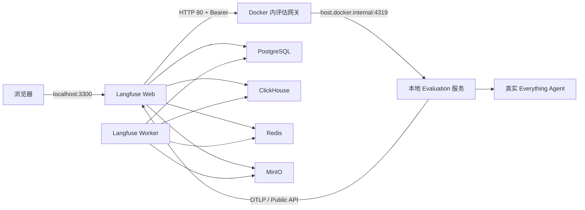

# 本地 Langfuse 一键部署

需要 Node.js 24.12+、pnpm、Docker Desktop（或带 Compose v2 的 Docker Engine）。先启动 Docker，然后在仓库根目录执行：

```bash
pnpm run langfuse:up
pnpm run dev
```

`langfuse:up` 自动完成：生成随机凭证、校验 Compose、启动服务并等待健康检查。首次需要下载镜像，建议为 Docker 预留至少 4 GB 内存。它不会启动 Agent 本身，Agent 模型和工具继续在本地运行。

- Langfuse 管理平台：`http://localhost:3300`。
- 首次登录邮箱与密码：查看 `.langfuse/compose.env` 中 `LANGFUSE_INIT_USER_EMAIL`、`LANGFUSE_INIT_USER_PASSWORD`。脚本不在终端打印密码。
- 项目和 API Key 自动初始化；Everything Agent 后端自动读取同一文件。
- 在本地 Evaluation 页面点击“连接平台”开始使用；[平台触发配置和用例格式](../../src/evaluation/README.md)。

## 包含的服务

`compose.yaml` 完整包含 Langfuse Web、Worker、PostgreSQL、ClickHouse、Redis、MinIO 和评估网关，不依赖另外一份 Compose。



Langfuse v4 的远程 Experiment 地址只接受 80/443 端口，因此内置网关监听容器 80 端口，再转发到本机 4319。网关没有宿主端口映射，平台白名单只允许 `evaluation-gateway`。本地服务仅接受专用鉴权令牌，不暴露 Agent 管理接口。

Web 的 3300 和 MinIO 的 9390 只绑定 `127.0.0.1`。数据库和 Redis 不发布宿主端口，不与现有本地 PostgreSQL/MySQL 服务争用端口。Linux 通过 `host-gateway` 解析宿主机，macOS / Windows Docker Desktop 也可使用；Agent 终端工具仍受项目支持的平台和沙箱约束。

## 日常命令

```bash
pnpm run langfuse:status
pnpm run langfuse:down
pnpm run langfuse:up
```

停止不会删除数据卷；再次启动保留账号、API Key、数据集和 Experiment 记录。不要删除 `.langfuse/compose.env`，其中的加密密钥必须与原数据匹配。脚本重复执行不会重写此文件。

也可以直接使用完整 YAML：

```bash
docker compose --env-file .langfuse/compose.env -f deploy/langfuse/compose.yaml up -d --wait
```

首次仍需先运行 `pnpm run langfuse:up` 生成私有配置。YAML 中没有可投入使用的默认密码；缺少凭证会立即报错。

当前使用 Langfuse 官方 v4 镜像和官方部署架构；PostgreSQL 17、ClickHouse 25.12、Redis 7。镜像标签可能发布更新，`up` 使用本地已有镜像；需要升级时先备份数据库和配置，再按 Langfuse 官方升级说明操作。

## 排查

- Docker 未启动：启动 Docker Desktop，再执行 `pnpm run langfuse:up`。
- 3300 或 9390 被其他服务占用：先释放端口。
- 平台显示 502：确认 `pnpm run dev` 正在运行，本机 4319 可被 Docker 访问。
- 平台显示 401：在 Evaluation 页面重新复制 Authorization 值，并更新数据集的 Custom headers。
- 没有评分：先在 Langfuse 配置面向 Experiment 根 Agent observation 的评估器，再在 Evaluation 点击刷新评分。
- 启动超时：用 `docker compose --env-file .langfuse/compose.env -f deploy/langfuse/compose.yaml logs --tail 100` 检查服务，不要公开含凭证的配置或日志。

官方参考：[Docker Compose 部署](https://langfuse.com/self-hosting/deployment/docker-compose)、[远程 Experiment 触发](https://langfuse.com/docs/evaluation/experiments/experiments-via-sdk)。

## 日常聊天的 Trace

部署完成不会自动开启日常聊天导出。按 [Tracing 配置](../../src/tracing/README.md) 设置 `.everything/langfuse.env` 后重启 Agent。exporter 从实时事件流生成 OTEL spans，通过本服务的 OTLP 入口上传；日常导出和 Evaluation 的 Experiment 上传相互独立。默认仅上传元数据，清除 Agent 本地数据不会删除 Langfuse 中的 traces。
