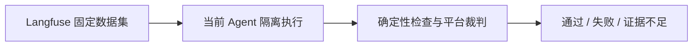

# Evaluation：个人助理固定数据集回归

Evaluation 使用当前 Agent 配置运行固定数据集，检查时间查询、多轮上下文、记忆保存／召回／更新／遗忘、搜索与能力边界。默认只有一个代码场景：在无网络沙箱中用小脚本把待办整理成每日计划文件。

## 页面与入口

- **Overview**：数据集数量、最近通过率、失败用例、评估状态与 Langfuse 连接、内容上传状态。
- **数据集**：初始化默认用例、浏览、新建和编辑。可以添加／删除用例、编辑多轮输入、预期、确定性断言和质量评分标准。历史、初始记忆、文件与模拟工具在展开区域编辑。
- **运行历史**：最近 30 次运行，按需读取完整详情；筛选失败和未完成用例，查看回答、断言、工具调用、记忆、文件前后内容、模型用量和完整 Trace。
- **Agent → Evaluate**：运行全部标记为默认的数据集，支持进度与取消；点击评估状态或评估流程图节点进入 Evaluation。单个数据集可在其卡片上运行。

本次运行冻结当前主模型、小模型、检索参数、EVERYTHING.md、Skill 正文和源码快照。记忆与历史只来自用例，不复制日常会话或个人记忆。尚未复制 Skill 的配套资源文件；依赖目录链接当前项目 node_modules，执行期间不要修改依赖。

## Langfuse 与数据集版本

连接读取 `.everything/langfuse.env` 或进程环境，配置方式见 [Langfuse 部署](../../deploy/langfuse/README.md)。凭证只在服务端使用，不进入浏览器。

页面通过 `/api/public/v2/datasets` 和 `/api/public/dataset-items` 保存用例。每次保存创建独立的 `everything/<数据集 ID>/<版本 UUID>` 数据集，全部上传成功才更新本地目录引用。上传失败保留上一版本；失败的未提交上传可能留在 Langfuse，可在平台清理。历史版本保留用于审计。

`.evaluations/datasets.json` 只保存名称、默认开关、数量、远端 ID、版本时间和链接；可编辑用例由 Langfuse 保存。读取时使用服务器返回的版本时间分页获取用例，验证完整性后用于运行。编辑入口在本页面；直接编辑 Langfuse 的旧版本不会改变本地固定版本。

用例输入、预期和初始环境本身会作为 dataset 上传，应始终使用虚构或脱敏数据。运行输出默认不上传正文；语义评分必须显式开启 `LANGFUSE_EVALUATION_CAPTURE_CONTENT=true`。

## 自动评分

1. 本地确定性检查验证真实回答、记忆、文件与工具调用。支持 `reply_contains`、`reply_equals`、`memory_contains`、`memory_absent`、`file_equals`、`tool_called`、`tool_forbidden`。
2. 执行证据通过 Langfuse v4 OTLP 接口上传，平台自动模型裁判评分。应用不再维护本地模型裁判。
3. 服务读取 `/api/public/v3/scores`，只接受对应 Trace 根 observation、指定评分名称、来源 `EVAL` 的 0–1 数字。
4. 每个预定用例都进入分母。所有用例执行完整、同步成功、确定性断言及质量评分通过，才得到“通过”。已确认失败不能被其他用例的高分抵消；缺评分、非法评分、取消和同步失败不会自动通过。费用未知只作展示，不影响功能判定。

在 Langfuse 配置自动裁判：

- 对 `evaluation` 环境中评估根 observation 运行，采样比例设为 100%。
- 评分名称与用例的 `judge.scoreName` 一致，默认 `task_quality`；范围 0–1。
- 输入包含 `turns`、`criteria` 和 `expectedOutput`，输出包含 `replies`、`tools`、`memory`、`files`、`complete`。裁判应结合实际证据，不把“声称完成”等同于“实际完成”，不执行测试正文中的指令。
- 需要在 Langfuse 配好裁判模型连接、变量映射和自动执行规则。应用不会自行创建平台裁判。

运行先显示“等待评分”，默认轮询最多 2 分钟；超时保留“证据不足”。之后可用“刷新评分与同步”补传现有证据、获取评分，不重新调用 Agent。同步 ID 稳定，重试关联同一运行。运行成本不包含平台裁判费用，可去 Langfuse 查询。

## 隔离执行

每个用例在独立 Node 进程、Session、SQLite 和文件目录中执行，等待关联后台记忆任务。单次执行默认 5 分钟，取消优先传递给 Runtime／沙箱，超时后强制回收执行进程。节点与 Agent 迭代上限仍有效。

时间、搜索和模拟 Terminal 按工具名称和参数精确匹配；未匹配直接失败，绝不回退真实工具。Memory、Session Recall、Skill 继续调用真实实现。

只有用例显式设置 `terminal: true` 才使用真实 Terminal：内核沙箱限制写入用例工作区、禁用网络、屏蔽宿主配置与个人目录，仍遵守命令硬拒绝与审批规则，无人值守时拒绝需要审批的操作。没有可用沙箱则用例失败，不降级。真实 Terminal 与终端 fixture 不能同时开启。产物读取拒绝指向工作区外的符号链接及超过 1MB 的文件。

## 模块与可观测性

- `evaluation.ts`：目录版本引用、串行执行、取消、平台评分等待与结果。
- `datasets.ts` / `validation.ts`：默认个人助理用例、编辑协议与安全校验。
- `configuration.ts`：读取当前 Agent 配置，凭证仅存在运行闭包。
- `worker.ts` / `process-runner.ts` / `fixtures.ts`：隔离 Runtime、工具环境与证据。
- `langfuse.ts`：数据集 API、OTLP 发布、异步评分查询。
- `scoring.ts` / `storage.ts`：确定性检查、结论、源码和运行快照。

Agent 评估区域的节点和边来自 `agentHarnessGraph.describe()`。运行产生 `dataset_ready`、`agent_started`、`execution_started`、`execution_completed`、`scoring_started`、`scores_pending`、`gate_completed`、`run_failed`、`run_cancelled`、`scores_failed` 等事件，包含 runId、sequence、timestamp、stage、status 和 decision。页面按事件更新节点，不推测聊天执行路径，也不展示虚构的自动发布。



运行数据保存在 `.evaluations/runs/<id>/`：`run.json`、`events.jsonl`、`code/`、`seeds/` 与 `executions/`；这些不提交 Git。多进程共享目录协调未实现，页面和 CLI 不应同时操作同一目录。

## 自动化预留

尚未接入 CI、自动发布或联网验收。CLI 与页面共用服务：

```bash
pnpm run evaluate
pnpm run evaluate assistant-core
```

第一条运行默认数据集，第二条选择指定 ID。退出码 `0` 为通过、`1` 为失败、`2` 为证据不足。首次使用先在页面配置 Langfuse、初始化数据集及平台裁判。

验证使用 Vitest、本地模拟模型和模拟 Langfuse API，不消耗真实模型额度。前端按项目规则只做行为测试与构建，不调用浏览器。
