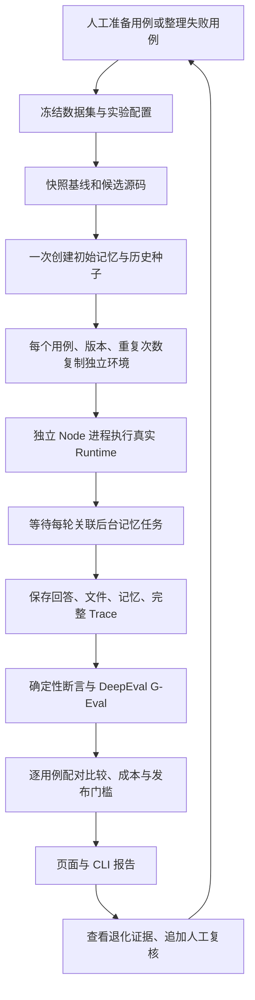

# Evaluation：个人助理离线回归评估

本模块已经实现固定测试条件下的双版本实验、隔离执行、确定性评分、DeepEval TypeScript G-Eval、逐用例比较、发布门槛、人工复核和回归用例回流。全程使用 Node.js / TypeScript，无 Python 服务，也不需要连接 Langfuse 或 Confident Cloud。

## 目标与边界

评估真实的个人助理 Runtime：保持会话、检索、工具选择、Skills、记忆管理和后台队列的执行路径。外部工具使用固定环境，避免评估过程中真实发送请求、执行任意终端命令或污染日常文件。

这是固定环境下的离线回归系统。联网验收、自动寻找根因、自动优化提示词、自动生成金标数据集、自动部署均未实现。页面的产物检查针对固定工具环境产生的状态；不等同于验证真实 shell 命令在操作系统中的效果。

## 模块组织

| 文件 | 职责 |
| --- | --- |
| `index.ts` | 评估服务、评分函数、配置校验的公开入口 |
| `types.ts` | 不包含密钥的配置、证据、评分、报告协议 |
| `validation.ts` | 不可信 JSON 校验、路径与凭证字段约束 |
| `evaluation.ts` | 实验调度、种子状态准备、比较、预算停止、人工复核 |
| `storage.ts` | 不可变源码快照、摘要与原子文件存储 |
| `process-runner.ts` | Node 子进程、取消、总时限、异常退出与凭证清理 |
| `worker.ts` | 单次 Runtime 执行、后台任务验收、证据收集 |
| `fixtures.ts` | 固定外部工具环境与审批行为 |
| `scoring.ts` | 确定性断言、配对比较、发布门槛 |
| `deepeval.ts` | DeepEval 0.9.16 的 G-Eval 接入，复用项目模型协议 |
| `example.ts` | 无凭证的可编辑起始配置 |
| `cli.ts` | CI / 本地命令入口 |
| `test/` | 公开接口行为测试 |

Web 使用独立的 `web/server/evaluation-service.ts`、`web/src/evaluation-api.ts` 与 `web/src/pages/evaluation/EvaluationPage.tsx`。Engine 不依赖评估模块。

## 已实现的闭环



## 快速开始

1. 启动 Web：`pnpm run dev:web`。
2. 打开 **Evaluation → 新建实验**，编辑 JSON 中的模型、源码目录、用例与预算。
3. 创建实验前检查凭证变量是否存在。模型密钥设置在启动服务的环境中；JSON 只填写环境变量名，如 `EVALUATION_MODEL_API_KEY`。不要把密钥写入测试集、Git 或报告。
4. 点击 **创建并运行**。页面显示执行进度，可取消。
5. 选择用例查看左右版本的回答、每次评分、文件与记忆状态、工具调用及完整 Trace。
6. 人工复核独立追加，不修改原始自动评分；“整理为回归实验”复制选中用例到新版本草稿，人工修改预期后再次运行。

复制模板到本地 JSON：

```bash
pnpm exec node --input-type=module -e 'import { exampleEvaluationPlan } from "./src/evaluation/index.ts"; console.log(JSON.stringify(exampleEvaluationPlan(process.cwd()), null, 2));' > /tmp/evaluation-plan.json
pnpm run evaluate /tmp/evaluation-plan.json
```

CLI 第二个参数可指定独立评估目录：

```bash
pnpm run evaluate /tmp/evaluation-plan.json /tmp/my-evaluations
```

退出码：`0` 通过，`1` 门槛失败，`2` 证据不足。CI 应把两种非零结果都视为不能发布。用例和规则变化时创建新的实验，不覆盖旧报告。

## 配置约定

### 版本

`baseline` 和 `candidate` 各包含：

- `sourceRoot`：已经准备好依赖的本地代码目录，允许使用两个不同 checkout。
- `systemPrompt`、`skills`、`maxIterations`、`maxTokens`、`modelContextWindow`。
- `agent` / `small`：协议、模型名、baseUrl、apiKeyEnv；每百万输入/输出 token 的美元价格可暂不填写，但成本将显示未知，发布结论为证据不足。
- `retrieval`：`lexical_only`、`dense_only` 或 `hybrid`；Dense/Hybrid 必须提供 OpenAI 兼容 Embedding 配置。模板固定为 `{text}`，可设置最低相似度。

源码快照包含实际 `src/`、`package.json`、`pnpm-lock.yaml` 内容及 SHA-256 摘要，包含尚未提交的源码。运行时从快照加载，因此不是只记下一个版本名。依赖目录使用来源 checkout 的 node_modules 链接，实验期间不得变更来源依赖。尚未做到完整容器镜像级复现。

两个版本都必须导出 `AGENT_RUNTIME_HOST_PROTOCOL = 1` 并支持受控宿主接口。更早的代码版本不能通过保留旧接口兼容逻辑运行；选择具备接口的基线提交即可。不同版本若使用不同的 Memory 数据结构，不能保证能消费同一数据库种子，失败会留在实验记录中，不自动迁移。

### 用例

- `id` / `name` / `critical`：稳定标识、说明和关键级别。
- `turns`：固定用户消息脚本，每轮保留同一会话，逐轮等待后台任务。
- `history`：起步时的历史用户消息和助手回复。
- `memory`：初始事实的 subject/content/source。
- `files`：初始相对文件路径和文本。
- `tools`：固定的时间、搜索、终端工具请求与结果，可声明文件效果和审批响应。
- `assertions`：确定性断言。
- `expectedOutput` / `criteria`：裁判参考答案和评分步骤；criteria 为空时不调用裁判。

初始 Memory 种子每个用例只创建一次，所有版本和重复共用该快照，保存相同初始 ID、来源和创建时间。每次复制到独立数据库后运行。操作系统时间仍是真实时间，固定日期通过时间工具 fixture 表达；没有全局虚拟时钟。

Dense/Hybrid 每次从同一初始事实构建对应配置的索引，构建耗时与费用包含在本次完成成本中。远程 Embedding 或模型行为变化仍可能带来波动。

### 固定工具环境

固定工具按工具名和参数对象精确匹配；参数通过工具 schema 校验。未配置工具不会出现在目录中，未匹配调用报错，绝不退回真实搜索或终端。

Memory、Session Recall、read_skill 始终调用原始工具。终端 fixture 继续检查硬拒绝规则与审批要求，必须审批的命令只有 `approval: true` 才产生声明的文件效果。工具参数和结果是测试数据，不应包含真实个人信息或秘密。

### 断言

| kind | 语义 |
| --- | --- |
| `reply_contains` / `reply_equals` | 最后一轮回答包含/等于 value |
| `memory_contains` / `memory_absent` | 最终事实正文包含/不包含 value |
| `file_equals` | 最终文件文本等于 value |
| `tool_called` | 至少一次成功调用，可额外匹配参数 |
| `tool_forbidden` | 不允许出现匹配的调用，失败尝试也算出现 |

不要求固定工具顺序，不会因合法的替代路径直接判错。复杂状态断言可在本模块添加明确类型与测试，不接受任意可执行 JavaScript 配置。

## DeepEval

锁定 TypeScript 包 `deepeval@0.9.16`，使用 `GEval.measure()` 计算评分。裁判通过项目 `createModelClient` 支持 OpenAI-compatible 和 Anthropic；评分请求只提供固定用户输入、实际回复与参考答案，不包含版本标签，也不自动上传完整 Trace。

子进程禁用 DeepEval 遥测，未配置 Confident 平台上传。`scoreWithDeepEval` 是可独立使用的公开评分函数；直接调用时由宿主管理模型环境与生命周期。

当前集成指标为 G-Eval；DeepEval 的原生 Task Completion、Tool Correctness、组件级和轨迹级指标尚未映射。工具硬约束由确定性断言完成，不能宣称现有 JSONL 已被转成 DeepEval 原生 spans。

## 耗时、成本与判定

- `responseMs`：各轮 Runtime 回合耗时之和。
- `totalMs`：环境准备、Agent、索引与后台任务的完成耗时，不包含随后模型评分。
- Agent 费用覆盖主模型、Gate、小模型、后台记忆模型与 Embedding；按配置中的价格估算，非供应商账单。
- 供应商未提供 usage、调用失败或缺少价格时标记 `null`，页面显示“未知”，不能当作零费用。
- 裁判费用独立记录；没有语义评分时为零。
- 总执行超时覆盖环境准备、Agent、后台任务及评分；进程结束后父进程清除临时凭证。
- 已知累计费用超过预算后停止新任务；配置了费用门槛但本次费用未知时也停止后续任务。正在执行的调用可能超出预算；这是调度停止线，不是供应商侧硬消费上限。

每个用例的分母始终是预设重复次数，失败不删除。任何费用或用量缺失都会阻止自动通过，即使未设置费用上限。先判关键候选用例硬失败，再检查执行完整性、评分错误、最小重复次数、成本与通过率门槛。已确认失败不能被其他高分抵消。

当前报告展示重复运行的经验通过率与变化，不计算统计显著性或置信区间。最小重复次数是操作门槛，不能证明模型无随机退化。人工追加实验应保留全部结果，不能挑选最好的一次发布。

## 数据与事件

默认根目录为 `.evaluations/`，与 `.everything/` 分离，不受日常 Agent 清理影响，也不提交 Git。

```text
.evaluations/<experiment-id>/
├── experiment.json       # 配置、结果、报告、人工复核
├── manifest.json         # 配置与源码指纹
├── events.jsonl          # 实验调度事件
├── code/{baseline,candidate}/
├── seeds/<case-id>/
└── executions/<case-id>-<variant>-<repeat>/
    ├── execution.json    # 单次执行证据和评分
    └── home/            # 隔离记忆、工作区、Skills 和完整 Trace
```

事件依次为 `experiment_started`、每次 `execution_started` / `execution_completed`、最终 `experiment_completed` / `experiment_failed` / `experiment_cancelled`。每条包含 experimentId、sequence、timestamp，执行事件附 executionId；它们是调度事实，不能替代 Agent observer。

单个服务实例只运行一个实验，内部顺序执行并交错版本先后顺序。中断后保留已有结果并展示“已中断/证据不足”，不自动恢复在途任务；复制配置重跑即可。多进程共享同一评估目录的协调尚未实现。

## Trace 与隐私

评估使用完整 JSONL 文件，不使用最近 N 条事件窗口。普通 Trace 页改为运行摘要分页、选择后读取完整详情和关联后台任务。

凭证过滤不等于个人信息匿名化。只使用人工准备的非敏感测试数据；保存的回答、文件、记忆和 Trace 都可能含用例正文。模型裁判仅接收必要字段。真实失败记录回流测试集前应人工脱敏并确认预期。

## 验证

```bash
pnpm run typecheck
pnpm run build
pnpm test
pnpm run test:coverage
pnpm run example
```

集成测试使用本地模拟模型驱动真实 Runtime 与 DeepEval TypeScript，不消耗真实模型额度。页面通过行为测试与构建检查验证，遵循项目要求不调用浏览器、不做截图验证。

### DeepEval 发布包补丁

0.9.16 发布包同时包含旧 `dist/telemetry.js` 和新 `dist/telemetry/index.js`，Node 优先加载旧文件会造成 `inComponentScope is not a function`，还会要求旧入口遗漏声明的 Sentry 依赖。`patches/deepeval@0.9.16.patch` 通过 pnpm 将入口直接转发到包内的新官方模块，不修改 G-Eval 评分算法，也不引入 Sentry。升级 DeepEval 时需重新验证补丁是否仍必要。

单次执行证据的 `complete` 表示是否完成最终状态采集。进程被取消或强制终止时保留已落盘的回合检查点或部分 Trace，标记不完整，不能据此发布通过。
