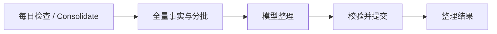

# Consolidation 机制

状态：已实现。本文说明每日与手动全量 Semantic Memory 整理的机制、作用及边界。

## 作用与范围

Consolidation 是对现有 Semantic Memory 的集中整理：将全量 semantic facts 交给模型审查，减少冗余、处理事实变化和冲突、清理低质量内容，使后续召回更准确。

输入仅包含当前 semantic facts 及其已有元数据。不读取 Chat Log、Session Recall 或其他 episodic evidence，不新增 episodic evidence 模块。现有界面的 Episodic / Session Recall 不作为本流程输入。

| 能力 | 目标行为 |
| --- | --- |
| 去重 | 删除表达不同但含义相同的冗余事实 |
| merge | 合并互补事实，保留有效信息和现有来源关联，删除冗余项 |
| 冲突检测 | 识别同一主体、属性下不能同时成立的事实，结合已有内容与元数据判断 |
| supersede | 有充分依据认定新事实替代旧事实时，直接更新或删除旧事实，不保存旧事实版本或替代链 |
| 低质量清理 | 清理缺乏有效信息、无长期价值或不适合作为稳定事实的记忆 |

模型不能凭空补全事实。仅凭 semantic facts 无法补回聊天中从未记录的内容，因此“漏记补偿”和“多条 episodic evidence 提炼为稳定事实”不在本次范围内。冲突依据不足时应报告未解决冲突，不应任意删除一方；判断规则由提示词、结构化输出及行为测试约束。

## 自动与手动触发

- 自动触发：按服务端本地时区的自然日，在用户当天首次进入 Agent 页面时检查并后台入队；当前使用场景为北京时间。
- 自动整理每天最多创建一个任务。日期与触发记录持久化，刷新页面、多标签页、重复请求和服务重启不重复创建。
- Agent 页面提供英文按钮 **Consolidate**。手动触发不受每日自动次数限制，可以在自动整理完成后再次执行。
- 同一时间最多存在一个待执行或正在执行的 consolidation 任务，自动与手动共用去重和并发保护；重复点击返回现有任务状态。
- 重试、重启恢复及上下文拆分产生的子任务均属于原整理任务，不算新的一次触发。
- 后台执行不阻塞正常聊天；页面显示排队、执行、完成或失败状态。

不再按聊天轮数或 Session 数量触发。已删除 `consolidationSessionInterval`、`EVERYTHING_CONSOLIDATION_SESSION_INTERVAL` 及相应配置界面、旧触发代码和测试，不保留兼容逻辑。

## 模型输入与执行机制

1. 入队时原子检查触发记录与已有任务，保存触发来源（自动或手动）。
2. 执行时读取全量 semantic facts，固定事实 ID 集合；各批次读取最新正文并记录全库版本；空库直接完成，不调用模型。
3. 计算上下文预算。完整请求预算包含系统提示、事实正文、必要元数据、结构化输出约束和输出预留。
4. 能放入一次请求时，将全部事实提交给模型；放不下时拆成两个或多个可恢复子任务，覆盖所有事实。
5. 模型返回结构化整理建议；代码验证目标 ID、事实版本、操作类型和合并内容，再执行变更。模型不能直接操作数据库。
6. 保存子任务检查点和操作凭据，汇总变更计数、未解决冲突和错误，更新任务状态。

Consolidation 继续使用后台记忆任务的模型依赖与持久化执行能力。它与聊天中的单条记忆写入在产品职责上独立；底层可以复用队列、校验和事务提交机制。

## 超过上下文限制时

拆分依据是模型上下文预算，不是固定事实条数。不能静默截断正文或只处理前若干条事实。单条事实也超限时，应明确报告限制并停止对应处理，不能假装全量完成。

分批需要考虑跨批次重复和冲突：优先将相关主体和属性放在一起，并对跨批次关联安排补充审查。不能把互不相见的任意分片结果宣称为已完成全库去重。当前实现按主题排序，以最多半窗口的事实组为常规分组，逐对组合审查。总计最多 256 个子任务；无法放入一次请求的组合明确失败。估算器沿用运行时 token 估算器，预留最多 4096 输出 tokens（不超过窗口四分之一）及 512 安全余量。

所有子任务归属于同一个父任务，记录批次编号、总数、进度和检查点；受 256 个子任务、每次尝试 5 分钟超时及执行信号约束，不允许无限反复合并。无法在预算内完成的部分必须可观察地报告。

## 一致性、失败恢复与审计

- 写入前检查事实是否已被其他操作更新或删除，避免旧快照覆盖用户的新修改；冲突需要重新审查或明确报告。
- 合并、删除和更新按事务执行；操作凭据与变更原子提交，重试不重复写入。
- 重启恢复原任务和检查点，不能另建每日任务；部分完成与最终失败应明确可见。
- 不保留被 supersede 或清理的旧事实正文与历史版本；审计保留操作类型、目标 ID、原因代码、时间和结果等元数据，不以审计为名保存旧事实副本。
- 默认事件和 trace 不记录完整私人事实、完整模型输入、密钥或令牌。

## Agent 画布

Consolidation 在 Agent 画布上拥有独立区域，与 Agent Loop、聊天记忆写入、新建 Session 等其他流程**没有连线**。共享底层执行组件不意味着画布需要画出跨区域连接。

内部流程如下：

静态节点与边必须来自 `Graph.describe()`，不在前端手工复制。动态状态由真实 observer 事件驱动，按 `consolidation → batch → model / reviewed / change` 展示整理运行、批次进度、模型调用、耗时、变更计数和错误，不增加 memory_task 层级；事件名称及字段见 [Memory 事件说明](./README.md#后台-consolidation)。

## 行为约束

- 每日首次使用自动触发，刷新、多标签页、重启不重复；跨日重新具备自动触发资格。
- 手动按钮为 **Consolidate**，可额外执行，并与自动任务互斥。
- 请求只使用全量 semantic facts 与已有元数据，不读取聊天或 episodic evidence。
- 去重、merge、冲突处理、supersede、低质量清理有公开接口行为测试；不保留旧事实版本。
- 上下文不足时覆盖全部输入，并测试跨批次关联、失败恢复和超限情况。
- 画布独立成区、无外部连线，静态拓扑与动态事件均有测试。
- 现有实现文档已更新，旧 Session 阈值机制及其配置说明已移除。

## 当前边界

- 分批固定本次事实 ID 集合，任务启动后新增的事实留给下次整理；每批重新读取现有正文，版本冲突重试当前批次。
- 未解决冲突只保存审查计数，不保存正文或独立冲突档案；同一关联在多批次出现时可能重复计数。
- 子任务提供跨组共同审查机会，不能保证模型必然识别所有语义重复或冲突。
- 失败最多执行三次，间隔 1 秒和 2 秒；自动配额按任务创建占用，失败后可手动重试。
- 自动检查遇到已有手动或跨日任务时复用该任务并记录当天检查，避免完成后又自动创建任务。
- 未配置模型时自动检查不创建任务、不占用每日配额；空事实库直接完成，不调用模型。
