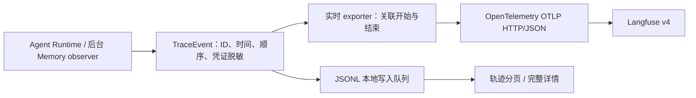

# 运行时 Trace 与 Langfuse

## 标识与协议

JSONL 使用版本 3，不读取旧事件协议作为有效记录，也不保留旧字段别名。

- `turnId` 表示聊天回合，生命周期为 `turn_started`、`turn_completed`、`turn_failed`，文件为 `<序号>-turn-<turnId>.jsonl`。
- `taskId` 表示后台写入或整理任务；写入可通过 `sourceTurnId` 关联来源回合，任务事件不携带聊天 `turnId`。
- `traceId` 是所有记录共有的观测归组键，直接采用 `taskId`、`turnId`、`rebuildId` 或 `operationId`（按此优先级），没有业务标识的系统事件生成 UUID。`sequence` 在每条轨迹内递增。
- Langfuse 用 `traceId` 构造平台轨迹标识；聊天根 observation 名称为 `turn`，元数据保留真实的 `turnId` 或 `taskId`。
- `GET /api/local-agent/traces` 返回 `{ traces, nextCursor }`；通过 `?traceId=...` 读取完整详情及其派生任务。

## 已实现的记录链路



`createRuntimeTracer` 接收运行时事件，统一生成 `TraceRecord` 后分流。每个事件等待本地写入，网络导出异步执行；导出器不读取 JSONL，也不等待整轮聊天结束。已经完成的步骤最迟在下一个一秒发送周期进入队列，或累计 64 个 spans 后立即入队。运行完成会触发发送，Runtime 关闭时等待导出和本地写入。

使用标准 OTLP HTTP/JSON 将 spans 发送至 `/api/public/otel/v1/traces`，携带 `x-langfuse-ingestion-version: 4`。不注册全局 OTEL provider，不自动截获模型或 HTTP 请求，不需要部署额外 Collector。协议参考：[Langfuse OTEL 接入](https://langfuse.com/integrations/native/opentelemetry)。

事件映射：回合 → agent，模型/Gate/记忆裁判 → generation，工具 → tool，自动检索 → retriever，向量调用 → embedding，其余单点事件 → event。生命周期按 `modelCallId`、`toolCallId` 或 `operationId` 匹配。工具内部事件关联工具步骤；整理模型和变更关联批次。没有开始事件时只记录瞬时事件，不猜测耗时；关闭时未完成步骤标记为不完整。

后台记忆任务、consolidation 和索引重建有独立 trace；记忆写入保留 `sourceTurnId`、`taskId`。无回合的 Embedding 调用用 `operationId` 关联，重建期间用 `rebuildId` 归组。静态拓扑仍以 `Graph.describe()` 为准。

队列最多 256 个请求，每批最多 64 个 spans，每个请求超时 5 秒。网络错误、OTLP 部分拒绝、队列溢出和活跃步骤超限会记录本地 `langfuse_export_failed`，该事件不再上传。网络失败后冷却 5 秒，冷却期间跳过待发请求；同类错误在一个 exporter 生命周期内只告警一次。网络失败不阻断聊天，未上传事件仍保存在 JSONL；目前没有自动重传、离线补传或进程崩溃后重放。

## 启用日常运行导出

在 `.everything/langfuse.env` 中配置，或设置同名宿主环境变量（环境变量优先）：

```dotenv
LANGFUSE_ENABLED=true
LANGFUSE_BASE_URL=http://localhost:3300
LANGFUSE_PUBLIC_KEY=你的项目公钥
LANGFUSE_SECRET_KEY=你的项目私钥
LANGFUSE_CAPTURE_CONTENT=false
```

本地部署项目的公钥、私钥分别对应 `.langfuse/compose.env` 中的 `LANGFUSE_INIT_PROJECT_PUBLIC_KEY`、`LANGFUSE_INIT_PROJECT_SECRET_KEY`；不要将这些值提交到仓库或返回浏览器。未显式启用时仅写本地。配置在记录器首次创建时加载，修改后重启服务生效。无效配置留下本地错误记录，本次实例继续仅写 JSONL。

默认只导出允许的元数据、模型名称和真实 token 用量。`LANGFUSE_CAPTURE_CONTENT=true` 才附带可用的模型请求/回复、工具参数/结果和回合输入/输出。凭证脱敏不等于个人信息匿名化；本地 JSONL 保留既有模型输入快照规则，可能包含私人内容。Skill 加载事件只保存名称、正文 SHA-256 和长度。

清除本地数据仍只删除本地数据，保留 `langfuse.env`，不会请求删除远端 traces。评估 Runtime 用 `{ langfuse: false }` 关闭日常 exporter，沿用独立评估上传链路，避免重复导出。

## 完整读取与轨迹分页

从 `src/index.ts` 或 `src/tracing/trace-reader.ts` 导入：

```ts
const page = await listTraces(home, { pageSize: 20 });
const next = page.nextCursor
  ? await listTraces(home, { pageSize: 20, cursor: page.nextCursor })
  : null;
const files = page.traces[0] ? await readTrace(home, page.traces[0].traceId) : [];
```

- `readTraceFiles`、`readTraceRecords` 和 Runtime `readTraces()` 读取全部记录，不接收条数上限。
- 列表默认每页 20 条轨迹，可通过接口指定 1–100。摘要仅包含 `traceId`、开始时间、事件数和状态。
- 按开始时间倒序，同一时间按 traceId 排序。游标固定第一页的排序上界，新轨迹通过刷新首页查看。它不是数据库事务快照，追加记录和迟到事件仍可能影响结果。
- `readTrace` 读取指定轨迹和关联后台任务的完整记录，包含恢复文件。损坏行使用稳定标识转换为 `trace_read_error`，分页与详情可重复定位。
- Web 保留文件默认展开、事件默认折叠的展示方式。同一页关联文件中的重复事件去重。底部分页区显示页码、轨迹数和文件数；加载期间禁用翻页，失败保留当前页，刷新返回第一页。
- 目前读取端扫描 JSONL 构造分页和详情，没有持久化索引。分页限制返回的轨迹数量，不截断单条轨迹；非常长的轨迹仍可能产生较大响应。
